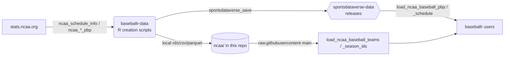

# baseballr-data

[](https://twitter.com/sportsdataverse)
[](https://twitter.com/saiemgilani)
<a href="https://github.com/saiemgilani" target="blank"></a>

[](https://github.com/sportsdataverse/baseballr-data/actions/workflows/daily_ncaa_baseball.yml)

The data-pipeline repository for [**baseballr**](https://github.com/BillPetti/baseballr).
It builds clean, tidy NCAA college baseball datasets and publishes them as
**GitHub release assets on
[`sportsdataverse/sportsdataverse-data`](https://github.com/sportsdataverse/sportsdataverse-data/releases)**,
where the `baseballr` `load_ncaa_baseball_*()` functions read them from. Two
small lookup tables are served directly from this repo's `main` branch.

## How the pipeline works



1. The GitHub Actions workflow
   [`daily_ncaa_baseball.yml`](.github/workflows/daily_ncaa_baseball.yml) runs on
   a seasonal schedule (and on `workflow_dispatch` / `repository_dispatch`).
2. It calls [`scripts/daily_ncaa_baseball_R_processor.sh`](scripts/daily_ncaa_baseball_R_processor.sh),
   which loops over the requested seasons and runs the creation scripts.
3. Each creation script writes per-year `rds`/`csv`/`parquet` artifacts under
   `ncaa/` (committed back to this repo) **and** calls
   `sportsdataversedata::sportsdataverse_save()` to upload those assets to the
   matching release tag on `sportsdataverse-data` (overwriting the season's
   existing assets).
4. `baseballr`'s `load_*()` functions download the release assets on demand.

## Data releases

Published to **`sportsdataverse/sportsdataverse-data`** releases (one tag per
dataset; assets are named `*_{year}.rds` / `.csv` / `.parquet`):

| Release | Loader | Asset pattern |
|---|---|---|
| [`ncaa_baseball_pbp`](https://github.com/sportsdataverse/sportsdataverse-data/releases/tag/ncaa_baseball_pbp) | `baseballr::load_ncaa_baseball_pbp()` | `ncaa_baseball_pbp_{year}.rds` |
| [`ncaa_baseball_schedules`](https://github.com/sportsdataverse/sportsdataverse-data/releases/tag/ncaa_baseball_schedules) | `baseballr::load_ncaa_baseball_schedule()` | `ncaa_baseball_schedule_{year}.rds` |
| [`mlb_game_state`](https://github.com/sportsdataverse/sportsdataverse-data/releases/tag/mlb_game_state) | `sportsdataverse.mlb.load_mlb_re24_matrix()` / `_we_table` / `_wpa` (Python) | `mlb_{stem}_{season}.{csv,rds,parquet}` |
| [`mlb_hitting_models`](https://github.com/sportsdataverse/sportsdataverse-data/releases/tag/mlb_hitting_models) | `load_mlb_expected_stats()` / `_expected_hr` / `_batter_projection` | `mlb_{stem}_{season}.{csv,rds,parquet}` |
| [`mlb_fielding_models`](https://github.com/sportsdataverse/sportsdataverse-data/releases/tag/mlb_fielding_models) | `load_mlb_oaa()` / `_catcher_framing` | `mlb_{stem}_{season}.{csv,rds,parquet}` |
| [`mlb_pitching_models`](https://github.com/sportsdataverse/sportsdataverse-data/releases/tag/mlb_pitching_models) | `load_mlb_xera()` / `_stuff_plus` / `_command_plus` | `mlb_{stem}_{season}.{csv,rds,parquet}` |

> Note the schedules release uses the **plural** tag `ncaa_baseball_schedules`
> with **singular** asset names `ncaa_baseball_schedule_{year}`.

Served directly from this repo's `main` branch (not releases):

| File | Loader |
|---|---|
| [`ncaa/teams_info/ncaa_team_lookup.{csv,rds,parquet}`](ncaa/teams_info/) | `baseballr::load_ncaa_baseball_teams()` |
| [`ncaa/seasons_info/ncaa_season_id_lu.{csv,rds,parquet}`](ncaa/seasons_info/) | `baseballr::load_ncaa_baseball_season_ids()` |

## Consuming the data

```r
# install.packages("baseballr")  # or remotes::install_github("BillPetti/baseballr")
library(baseballr)

# play-by-play / schedule come from sportsdataverse-data releases
pbp   <- load_ncaa_baseball_pbp(seasons = 2024)
sched <- load_ncaa_baseball_schedule(seasons = 2023:2024)

# team + season-id lookups come from this repo's main branch
teams   <- load_ncaa_baseball_teams()
seasons <- load_ncaa_baseball_season_ids()
```

You can also read release assets directly without `baseballr`:

```r
# parquet (fastest)
arrow::read_parquet(
  "https://github.com/sportsdataverse/sportsdataverse-data/releases/download/ncaa_baseball_pbp/ncaa_baseball_pbp_2024.parquet"
)
```

## Update schedule

All times UTC. The workflow refreshes the current season (resolved from
`baseballr:::most_recent_ncaa_baseball_season()` when no input is given):

| Window | Cadence | Cron |
|---|---|---|
| In-season (Feb–Jun) | Daily | `0 11 * 2-6 *` |
| Off-season (Jul–Jan) | Monthly (1st) | `0 11 1 1,7-12 *` |

Manual / backfill runs: trigger **Update NCAA Baseball Data** via
*workflow_dispatch* with `start_year` / `end_year` (and `rescrape=TRUE` to
re-pull raw JSON from stats.ncaa.org rather than reuse cached files).

## Repository layout

```
R/
  0000_create_baseballr_releases_init.R   # one-time: create the release tags
  0001_push_existing_release_data.R       # one-time: backfill historical seasons
  ncaa_01_schedules_creation.R            # build + publish schedules (per year)
  ncaa_02_pbp_creation.R                  # build + publish play-by-play (per year)
  ncaa_teams_info.R                       # rebuild ncaa_team_lookup
  ncaa_season_ids.R                       # rebuild ncaa_season_id_lu
  ncaa_teams_season_team_id_backfill.R    # backfill season_team_id (inst_team_list)
  ncaa_teams_roster_gapfill.R             # roster-based season_team_id gap-fill
scripts/
  daily_ncaa_baseball_R_processor.sh      # per-year orchestrator (used by CI)
  daily_ncaa_baseball_scraper.sh          # manual entry point: schedules (git wrapper)
  daily_ncaa_baseball_pbp_scraper.sh      # manual entry point: play-by-play (git wrapper)
  bash_functions.sh                       # shared shell helpers
.github/workflows/
  daily_ncaa_baseball.yml                 # scheduled NCAA release-update workflow
  mlb_models_cron.yml                     # daily MLB model datasets (Apr-Oct)
pyproject.toml / uv.lock                  # root uv project (Python producers under python/)
python/
  mlb_model_publish/                      # MLB model-dataset publisher (4 release tags)
  ncaa_pbp/                               # NCAA baseball pbp discover+capture producer
  tests/                                  # Python tests (uv run pytest)
ncaa/
  schedules/{rds,csv,parquet}/            # compiled per-year schedule artifacts
  pbp/{rds,csv,parquet}/                  # compiled per-year play-by-play artifacts
  teams_info/                             # ncaa_team_lookup.* (load_ncaa_baseball_teams)
  seasons_info/                           # ncaa_season_id_lu.*  (load_ncaa_baseball_season_ids)
mlb/
  {game_state,hitting_models,...}/parquet/  # committed MLB model-dataset tree (cron-maintained)
  *.rda                                   # static lookup tables (historical archive)
statcast/                                 # static historical Statcast monthly extracts
```

## Maintainer setup

- **Secrets:** the workflow uploads cross-repo to `sportsdataverse-data`, so it
  uses `secrets.SDV_GH_TOKEN` (a PAT with write access to that repo), passed to
  the R scripts as `GITHUB_PAT`. `secrets.GITHUB_TOKEN` is used for this repo's
  git operations and dependency installation.
- **First-time bootstrap (run once, locally or manually):**
  ```r
  Sys.setenv(GITHUB_PAT = "<PAT with write access to sportsdataverse-data>")
  source("R/0000_create_baseballr_releases_init.R")  # create empty release tags
  source("R/0001_push_existing_release_data.R")      # backfill historical seasons
  ```
- **Dependencies:** `arrow`, `data.table`, `dplyr`, `glue`,
  `purrr`, `rvest`, `httr`, `httr2`, `optparse`, plus `piggyback` (release creation) and
  `sportsdataversedata` (`sportsdataverse_save()`); the GitHub CLI (`gh`) must be
  available on the runner for asset uploads.
