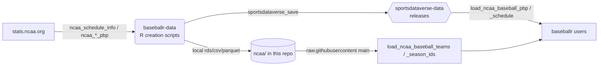
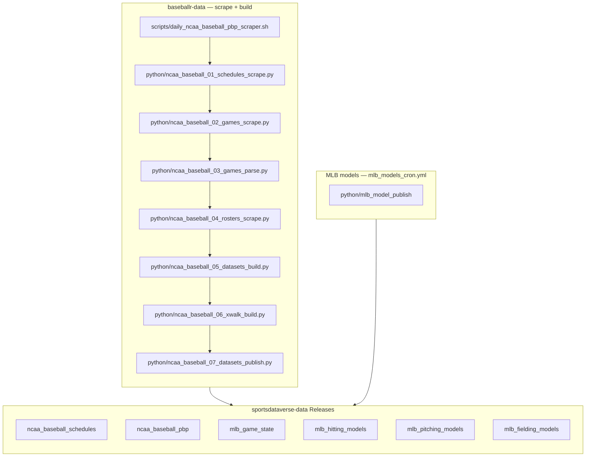

# baseballr-data

[](https://twitter.com/sportsdataverse)
[](https://twitter.com/saiemgilani)
<a href="https://github.com/saiemgilani" target="blank"></a>

[](https://github.com/sportsdataverse/baseballr-data/actions/workflows/daily_ncaa_baseball.yml)

The data-pipeline repository for [**baseballr**](https://github.com/BillPetti/baseballr).
It builds clean, tidy NCAA college baseball datasets and publishes them as
**GitHub release assets on
[`sportsdataverse/sportsdataverse-data`](https://github.com/sportsdataverse/sportsdataverse-data/releases)**,
where the `baseballr` `load_ncaa_baseball_*()` functions read them from. Two
small lookup tables are served directly from this repo's `main` branch.

## How the pipeline works



1. The GitHub Actions workflow
   [`daily_ncaa_baseball.yml`](.github/workflows/daily_ncaa_baseball.yml) runs on
   a seasonal schedule (and on `workflow_dispatch` / `repository_dispatch`).
2. It calls [`scripts/daily_ncaa_baseball_R_processor.sh`](scripts/daily_ncaa_baseball_R_processor.sh),
   which loops over the requested seasons and runs the creation scripts.
3. Each creation script writes per-year `rds`/`csv`/`parquet` artifacts under
   `ncaa/` (committed back to this repo) **and** calls
   `sportsdataversedata::sportsdataverse_save()` to upload those assets to the
   matching release tag on `sportsdataverse-data` (overwriting the season's
   existing assets).
4. `baseballr`'s `load_*()` functions download the release assets on demand.

### MLB raw capture (manual)

The MLB model tags are built from a committed per-game raw layer rather than
from live pulls: `mlb/raw/statsapi/{season}/{game_pk}.json.gz` (statsapi
`feed/live`) and `mlb/raw/savant/{season}/{game_pk}.csv.gz` (Baseball Savant
per-pitch), enumerated by `mlb/raw/manifest/{season}.csv`. Capture once, commit
the payload, reshape deterministically -- see
[`docs/mlb-raw-layer.md`](docs/mlb-raw-layer.md) for the design and the measured
sizing, and [`RUNBOOK-MLB.md`](RUNBOOK-MLB.md) for the stages.

```sh
./scripts/run_mlb_01_schedule_scrape.sh --season 2024
./scripts/run_mlb_02_statsapi_scrape.sh --season 2024 --commit-every 500
./scripts/run_mlb_03_savant_scrape.sh   --season 2024 --commit-every 60
```

### NCAA capture campaign (manual)

The daily workflow above maintains the *published* seasons. Capturing a season
from scratch is a separate, human-run campaign against `stats.ncaa.org`: it is
slow, rate-sensitive, and every stage is file-exists resumable, so it is driven
from a terminal rather than from CI.

Run the whole thing with the orchestrator — newest season to oldest, committing
and pushing per stage:

```sh
./scripts/run_backfill_all.sh 2026 2024      # SHARDS=8 by default
tail -f logs/bf_2026_*.log
```

It stops cleanly once a season's D1 team list comes back empty (the coverage
floor). To drive one stage at a time — re-running a failed stage, or filling a
single division — each has its own launcher. The order below is the one
`run_backfill_all.sh` itself uses; [`RUNBOOK.md`](RUNBOOK.md) documents the
manual one-season order and the per-stage detail.

| Stage | Launcher | Network | What it does |
|---|---|---|---|
| 01 | `scripts/run_01_schedules_scrape.sh` | online | team lists + team pages → persisted html + `ncaa/schedule_master/parquet/{season}.parquet` |
| 04 | `scripts/run_04_rosters_scrape.sh` | online | `teams/{id}/roster` → `ncaa/rosters_html/{season}/` |
| 02 | `scripts/run_02_games_scrape.sh` | online | the 5-tab bundle per uncaptured contest → `ncaa/raw/{season}/{contest_id}.json.gz` |
| 03 | `scripts/run_03_games_parse.sh` | offline | raw bundles + legacy R-era trees → parsed payloads under `ncaa/json/` |
| 06 | `scripts/run_06_xwalk_build.sh` | mostly offline | NCAA↔ESPN game crosswalk → `ncaa/xwalk/espn_game_id/{season}.json` |
| 03 | `scripts/run_03_games_parse.sh` | offline | re-run, so parsed payloads pick up the ESPN stamps from 06 |
| 05 | `scripts/run_05_datasets_build.sh` | offline | persisted html → `ncaa/{teams,schedule_master,rosters}` reference parquet |
| 07 | `scripts/run_07_datasets_publish.sh` | offline + `gh` | season frames under `ncaa/{dataset}/parquet/`, then the release upload |

Stage 03 runs twice on purpose: the second pass is what writes the ESPN game
ids that stage 06 resolves. Stage 02 is the one to chunk (`--max`) and fan out
across disjoint `--shard i/N` processes; a ban hard-stops that run with `rc=1`,
so cool down and re-run — it resumes from what is already on disk.

Each launcher prints its own usage; `--season` (the **calendar** year — 2026 is
the spring-2026 season) is required, and `--division` narrows stages 01 and 04.



`scripts/daily_ncaa_baseball_pbp_scraper.sh` is the daily driver (the `00` role);
stage numbers are intended build order, not run order. The R chain
(`R/ncaa_01_schedules_creation.R`, `R/ncaa_02_pbp_creation.R`) is the maintained
methodological twin.

## Data releases

Published to **`sportsdataverse/sportsdataverse-data`** releases (one tag per
dataset; assets are named `*_{year}.rds` / `.csv` / `.parquet`):

| Release | Loader | Asset pattern |
|---|---|---|
| [`ncaa_baseball_pbp`](https://github.com/sportsdataverse/sportsdataverse-data/releases/tag/ncaa_baseball_pbp) | `baseballr::load_ncaa_baseball_pbp()` | `ncaa_baseball_pbp_{year}.rds` |
| [`ncaa_baseball_schedules`](https://github.com/sportsdataverse/sportsdataverse-data/releases/tag/ncaa_baseball_schedules) | `baseballr::load_ncaa_baseball_schedule()` | `ncaa_baseball_schedule_{year}.rds` |
| [`mlb_game_state`](https://github.com/sportsdataverse/sportsdataverse-data/releases/tag/mlb_game_state) | `sportsdataverse.mlb.load_mlb_re24_matrix()` / `_we_table` / `_wpa` (Python) | `mlb_{stem}_{season}.{csv,rds,parquet}` |
| [`mlb_hitting_models`](https://github.com/sportsdataverse/sportsdataverse-data/releases/tag/mlb_hitting_models) | `load_mlb_expected_stats()` / `_expected_hr` / `_batter_projection` | `mlb_{stem}_{season}.{csv,rds,parquet}` |
| [`mlb_fielding_models`](https://github.com/sportsdataverse/sportsdataverse-data/releases/tag/mlb_fielding_models) | `load_mlb_oaa()` / `_catcher_framing` | `mlb_{stem}_{season}.{csv,rds,parquet}` |
| [`mlb_pitching_models`](https://github.com/sportsdataverse/sportsdataverse-data/releases/tag/mlb_pitching_models) | `load_mlb_xera()` / `_stuff_plus` / `_command_plus` | `mlb_{stem}_{season}.{csv,rds,parquet}` |

> Note the schedules release uses the **plural** tag `ncaa_baseball_schedules`
> with **singular** asset names `ncaa_baseball_schedule_{year}`.

Served directly from this repo's `main` branch (not releases):

| File | Loader |
|---|---|
| [`ncaa/teams_info/ncaa_team_lookup.{csv,rds,parquet}`](ncaa/teams_info/) | `baseballr::load_ncaa_baseball_teams()` |
| [`ncaa/seasons_info/ncaa_season_id_lu.{csv,rds,parquet}`](ncaa/seasons_info/) | `baseballr::load_ncaa_baseball_season_ids()` |

## Consuming the data

```r
# install.packages("baseballr")  # or remotes::install_github("BillPetti/baseballr")
library(baseballr)

# play-by-play / schedule come from sportsdataverse-data releases
pbp   <- load_ncaa_baseball_pbp(seasons = 2024)
sched <- load_ncaa_baseball_schedule(seasons = 2023:2024)

# team + season-id lookups come from this repo's main branch
teams   <- load_ncaa_baseball_teams()
seasons <- load_ncaa_baseball_season_ids()
```

You can also read release assets directly without `baseballr`:

```r
# parquet (fastest)
arrow::read_parquet(
  "https://github.com/sportsdataverse/sportsdataverse-data/releases/download/ncaa_baseball_pbp/ncaa_baseball_pbp_2024.parquet"
)
```

## Update schedule

All times UTC. The workflow refreshes the current season (resolved from
`baseballr:::most_recent_ncaa_baseball_season()` when no input is given):

| Window | Cadence | Cron |
|---|---|---|
| In-season (Feb–Jun) | Daily | `0 11 * 2-6 *` |
| Off-season (Jul–Jan) | Monthly (1st) | `0 11 1 1,7-12 *` |

Manual / backfill runs: trigger **Update NCAA Baseball Data** via
*workflow_dispatch* with `start_year` / `end_year` (and `rescrape=TRUE` to
re-pull raw JSON from stats.ncaa.org rather than reuse cached files).

## Repository layout

<!-- BEGIN GENERATED: layout -->

```
baseballr-data/
├── R/   # R pipeline stages and publish toolchain
│   ├── 0000_create_baseballr_releases_init.R
│   ├── 0001_push_existing_release_data.R
│   ├── ncaa_01_schedules_creation.R
│   ├── ncaa_02_pbp_creation.R
│   ├── ncaa_season_ids.R
│   ├── ncaa_teams_info.R
│   ├── ncaa_teams_roster_gapfill.R
│   ├── ncaa_teams_season_team_id_backfill.R
│   ├── ncaa_util_01_schedules_conversion.R
│   ├── ncaa_util_02_pbp_conversion.R
│   └── utils.R
├── docs/   # explainers, model reports and dataset docs
│   └── models/
├── mlb/
│   ├── fielding_models/
│   ├── game_state/
│   ├── hitting_models/
│   └── pitching_models/
├── models/   # model artifacts, cards and the registry
├── ncaa/
│   ├── batter_box/
│   ├── contest_pbp/
│   ├── game_pbp/
│   ├── games/
│   ├── html/
│   ├── json/
│   ├── linescore/
│   ├── pbp/
│   └── … 17 more
├── python/   # Python pipeline stages, numbered in build order
│   ├── mlb_model_publish/
│   ├── ncaa_baseball_data_build/
│   ├── ncaa_pbp/
│   ├── mlb_model_01_game_state.py
│   ├── mlb_model_02_hitting.py
│   ├── mlb_model_03_pitching.py
│   ├── mlb_model_04_fielding.py
│   ├── ncaa_baseball_01_schedules_scrape.py
│   ├── ncaa_baseball_02_games_scrape.py
│   ├── ncaa_baseball_03_games_parse.py
│   ├── ncaa_baseball_04_rosters_scrape.py
│   ├── ncaa_baseball_05_datasets_build.py
│   ├── ncaa_baseball_06_xwalk_build.py
│   └── ncaa_baseball_07_datasets_publish.py
├── scripts/   # bash drivers (the daily/weekly entry points)
│   ├── _env.sh
│   ├── bash_functions.sh
│   ├── daily_ncaa_baseball_R_processor.sh
│   ├── daily_ncaa_baseball_pbp_scraper.sh
│   ├── daily_ncaa_baseball_scraper.sh
│   ├── mlb_models.sh
│   ├── render_model_docs.sh
│   ├── run_01_schedules_scrape.sh
│   ├── run_02_games_scrape.sh
│   ├── run_03_games_parse.sh
│   ├── run_04_rosters_scrape.sh
│   ├── run_05_datasets_build.sh
│   ├── run_06_xwalk_build.sh
│   ├── run_07_datasets_publish.sh
│   └── run_backfill_all.sh
├── statcast/
├── tests/   # test suite
│   ├── fixtures/
│   ├── test_capture.py
│   ├── test_data_build.py
│   ├── test_data_io.py
│   ├── test_data_publish.py
│   ├── test_discover.py
│   ├── test_mlb_model_publish.py
│   ├── test_model_manifest.py
│   ├── test_model_registry.py
│   ├── test_parse_legacy.py
│   ├── test_stage_numbering.py
│   ├── test_stages.py
│   └── test_xwalk.py
└── themes/   # plot themes
```

<!-- END GENERATED: layout -->

## Reports & explainers

<!-- BEGIN GENERATED: reports -->

| Report | What it is | Last updated |
|---|---|---|
| [Model registry](models/REGISTRY.md) | model | artifact | gates | retrain, one row per published model | 2026-09-01 |
| [Model reports & cards](docs/models/) | 4 files, one per item | 2026-09-01 |

<!-- END GENERATED: reports -->

## Automation & status

<!-- BEGIN GENERATED: status -->

| workflow | schedule | last run |
|---|---|---|
| [](https://github.com/sportsdataverse/baseballr-data/actions/workflows/daily_ncaa_baseball.yml) | on repo dispatch / dispatch | 2026-08-01 |
| [](https://github.com/sportsdataverse/baseballr-data/actions/workflows/mlb_models_cron.yml) | daily 10:30 UTC in Apr-Oct | 2026-08-31 |
| [](https://github.com/sportsdataverse/baseballr-data/actions/workflows/orphan_scripts.yml) | on push / PR / dispatch | 2026-08-27 |
| [](https://github.com/sportsdataverse/baseballr-data/actions/workflows/tests.yml) | on push / PR / dispatch | 2026-08-27 |

| release tag | assets | size | last publish |
|---|---:|---:|---|
| [`ncaa_baseball_schedules`](https://github.com/sportsdataverse/sportsdataverse-data/releases/tag/ncaa_baseball_schedules) | 59 | 88.0 MB | 2026-08-27 |
| [`ncaa_baseball_pbp`](https://github.com/sportsdataverse/sportsdataverse-data/releases/tag/ncaa_baseball_pbp) | 39 | 2,304.9 MB | 2026-08-27 |
| [`mlb_game_state`](https://github.com/sportsdataverse/sportsdataverse-data/releases/tag/mlb_game_state) | 109 | 85.3 MB | 2026-08-31 |
| [`mlb_hitting_models`](https://github.com/sportsdataverse/sportsdataverse-data/releases/tag/mlb_hitting_models) | 106 | 5.2 MB | 2026-08-31 |
| [`mlb_pitching_models`](https://github.com/sportsdataverse/sportsdataverse-data/releases/tag/mlb_pitching_models) | 109 | 7.2 MB | 2026-08-31 |
| [`mlb_fielding_models`](https://github.com/sportsdataverse/sportsdataverse-data/releases/tag/mlb_fielding_models) | 73 | 1.6 MB | 2026-08-31 |

<!-- END GENERATED: status -->

## Maintainer setup

- **Secrets:** the workflow uploads cross-repo to `sportsdataverse-data`, so it
  uses `secrets.SDV_GH_TOKEN` (a PAT with write access to that repo), passed to
  the R scripts as `GITHUB_PAT`. `secrets.GITHUB_TOKEN` is used for this repo's
  git operations and dependency installation.
- **First-time bootstrap (run once, locally or manually):**
  ```r
  Sys.setenv(GITHUB_PAT = "<PAT with write access to sportsdataverse-data>")
  source("R/0000_create_baseballr_releases_init.R")  # create empty release tags
  source("R/0001_push_existing_release_data.R")      # backfill historical seasons
  ```
- **Dependencies:** `arrow`, `data.table`, `dplyr`, `glue`,
  `purrr`, `rvest`, `httr`, `httr2`, `optparse`, plus `piggyback` (release creation) and
  `sportsdataversedata` (`sportsdataverse_save()`); the GitHub CLI (`gh`) must be
  available on the runner for asset uploads.

## Consumers

The packages that read what this repo produces:

- **R:** [baseballr](https://baseballr.sportsdataverse.org) — docs at <https://baseballr.sportsdataverse.org>
- **Python:** [`sportsdataverse.mlb / sportsdataverse.baseball`](https://github.com/sportsdataverse/sportsdataverse-py) — docs at <https://py.sportsdataverse.org>

## Stage inventory

Every numbered pipeline stage in `python/` (auto-listed; run subsets with the `scripts/*.sh` drivers by number or name):

- `python/mlb_raw_01_schedule_scrape.py`
- `python/mlb_raw_02_statsapi_scrape.py`
- `python/mlb_raw_03_savant_scrape.py`
- `python/mlb_model_01_game_state.py`
- `python/mlb_model_02_hitting.py`
- `python/mlb_model_03_pitching.py`
- `python/mlb_model_04_fielding.py`
- `python/ncaa_baseball_01_schedules_scrape.py`
- `python/ncaa_baseball_02_games_scrape.py`
- `python/ncaa_baseball_03_games_parse.py`
- `python/ncaa_baseball_04_rosters_scrape.py`
- `python/ncaa_baseball_05_datasets_build.py`
- `python/ncaa_baseball_06_xwalk_build.py`
- `python/ncaa_baseball_07_datasets_publish.py`

Model release tags published from here: `mlb_fielding_models`, `mlb_game_state`, `mlb_hitting_models`, `mlb_pitching_models`
