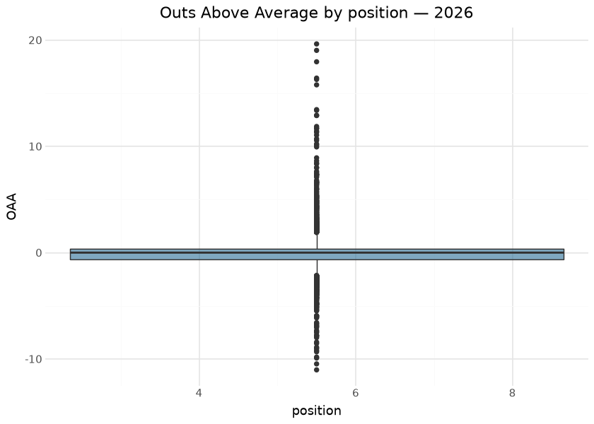
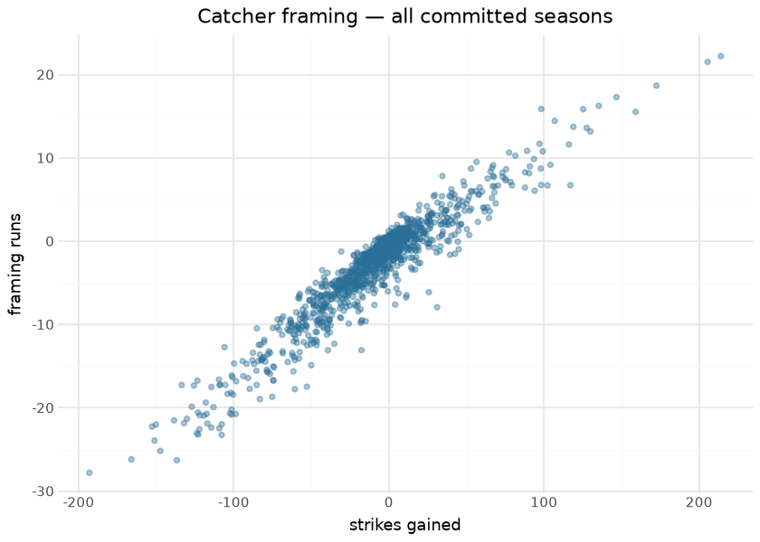
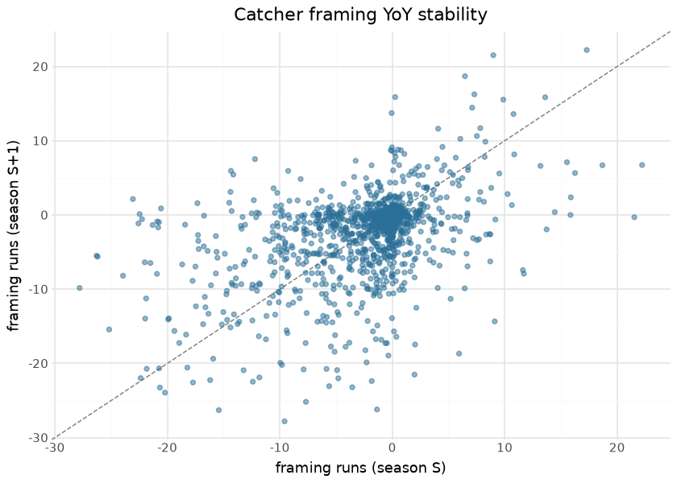

# MLB fielding models — OAA and catcher framing

Two surfaces ship on the `mlb_fielding_models` release tag: **Outs Above
Average** over balls in play, and **catcher framing** (called-strike
value above average at the zone edges). The builders live in sdv-py
(`mlb_fielding_oaa`, `mlb_catcher_framing`) over Baseball Savant
balls-in-play and pitch-location data; this repository commits
per-season outputs under `mlb/fielding_models/` and publishes them daily
in-season.

The design constraint is stated up front because it prices the gates:
the public feed lacks fielder start coordinates, so OAA here conditions
on batted-ball properties and fielder identity rather than true
opportunity geometry — a **feature-capped ceiling that is priced into
the gates** (OAA full-season Pearson vs Savant’s live OAA ≥ 0.55;
framing ≥ 0.40) instead of hidden. The registry also records what is
deliberately NOT published from this family (catcher throwing/blocking,
baserunning, SB value): their live floors of 0.03–0.073 against 0.80+
design targets are data-ceiling-limited, recorded so nobody “finds” the
gap later.

Given that ceiling, the evaluation that matters most is **year-over-year
reliability** — whether the surviving metrics measure something stable
about the fielder rather than re-rolling noise annually. That is
computed below across every adjacent committed season pair, per position
for OAA.

## Training data

| Committed fielding-model assets, by season |  |  |  |  |
|----|----|----|----|----|
| from mlb/fielding_models/parquet/; computed at render time |  |  |  |  |
| season | fielders | opportunities | catchers | takes |
| 2015 | 1193 | 102,365 | 145 | 368,404 |
| 2016 | 1390 | 103,060 | 144 | 380,358 |
| 2017 | 1470 | 102,048 | 148 | 376,360 |
| 2018 | 1471 | 102,371 | 145 | 375,346 |
| 2019 | 1548 | 107,311 | 142 | 376,480 |
| 2020 | 1343 | 44,547 | 140 | 151,704 |
| 2021 | 1842 | 118,317 | 179 | 381,514 |
| 2022 | 1944 | 119,811 | 185 | 371,389 |
| 2023 | 2317 | 124,052 | 208 | 395,530 |
| 2024 | 2126 | 123,882 | 202 | 387,767 |
| 2025 | 2549 | 129,533 | 231 | 407,814 |
| 2026 | 3116 | 117,170 | 280 | 373,923 |

&#10;

## Exploratory data analysis

The internal consistency check is visible in the framing scatter:
framing runs scale linearly with strikes gained at roughly the canonical
run value of a called strike. OAA centers near zero by construction at
every position — it is an *above-average* metric, so the league sums to
~0 each season:

| League OAA sum by season (zero-centering check) |                |          |
|-------------------------------------------------|----------------|----------|
| season                                          | league_oaa_sum | fielders |
| 2015                                            | 11.8           | 1193     |
| 2016                                            | 12.1           | 1390     |
| 2017                                            | 5.0            | 1470     |
| 2018                                            | 1.0            | 1471     |
| 2019                                            | 0.9            | 1548     |
| 2020                                            | 2.0            | 1343     |
| 2021                                            | 10.9           | 1842     |
| 2022                                            | 6.0            | 1944     |
| 2023                                            | 10.0           | 2317     |
| 2024                                            | 6.1            | 2126     |
| 2025                                            | 10.6           | 2549     |
| 2026                                            | 9.9            | 3116     |

&#10;

## Evaluation — year-over-year reliability

| Year-over-year reliability — same fielder, adjacent seasons |  |  |
|----|----|----|
| all committed season pairs pooled; higher = more stable skill |  |  |
| metric | pairs | yoy_pearson |
| Framing runs | 1375 | 0.459 |
| OAA — 8 | 1531 | 0.342 |
| OAA — 5 | 1490 | 0.337 |
| OAA — 9 | 1854 | 0.314 |
| OAA — 6 | 1316 | 0.310 |
| OAA — 4 | 1601 | 0.207 |
| OAA — 3 | 1330 | 0.164 |
| OAA — 7 | 1986 | 0.123 |
| OAA — 2 | 770 | 0.097 |

&#10;

Framing is famously the stickiest defensive skill and the reliability
table reproduces that: catcher framing tops the list, while OAA
reliability varies by position with the infield generally steadier than
the outfield at these sample sizes. This is the correct lens for a
feature-capped model — even without start coordinates, a metric that
correlates season-over-season is measuring the fielder, not the noise.

## Per-direction OAA

The undirected number says a fielder was worth +8 outs; it does not say
whether those came going back on the ball, charging in, or ranging
sideways. `mlb_oaa_direction` splits every fielder-position into `in` /
`back` / `lateral`.

The split is a **partition, not a re-fit**: it re-groups the same scored
balls in play, so its rows sum exactly to the published `mlb_oaa`. That
is the property worth checking, because a per-direction re-fit — the
tempting implementation — would silently produce three numbers that no
longer add up to the headline one.

<strong>Pending republish.</strong> The <code>mlb_oaa_direction</code> stem lands with the next rebuild. Validated on the real 2021 Savant season at build time: all 1,832 fielder-positions survive the split, <strong>max |sum(direction OAA) &minus; published OAA| = 3.6e-15</strong> and opportunities reconcile exactly. League OAA by direction ran back +400.7, in &minus;244.7, lateral &minus;145.1.

Two honest caveats travel with this split. First, Savant classifies
direction against the fielder’s **tracked start position**; the public
feed has no start coordinates (the same ceiling that prices this
family’s gates), so the position’s own median landing spot stands in for
“where this position normally plays”. Second, and more subtly, the depth
leg of that proxy is derived from landing distance — which is *also* an
input to the catch-probability logistic. So a systematic league-level
tilt between `back` and `in` (2021: +400.7 vs −244.7) partly reflects
residual structure in the catch surface by depth, not purely fielder
skill. The split is a genuine diagnostic for comparing fielders
**within** a direction; it should not be read as a calibrated
decomposition of league-wide value.

## Results

| Top 10 framing catchers — 2026 |  |  |  |  |
|----|----|----|----|----|
|  | Catcher | Takes | Strikes gained | Framing runs |
|  | Austin Wells | 6,889 | 35.7 | 3.3 |
|  | Jose Trevino | 3,355 | 7.7 | 3.1 |
|  | Ali Sánchez | 2,248 | 25.9 | 2.8 |
|  | Victor Caratini | 5,198 | 42.8 | 2.4 |
|  | Jimmy Crooks | 2,620 | 13.8 | 2.1 |
|  | Luis Torrens | 5,215 | 21.5 | 1.6 |
|  | Aramis Garcia | 957 | 10.4 | 1.5 |
|  | Alejandro Kirk | 4,393 | 22.3 | 1.3 |
|  | Brandon Valenzuela | 4,923 | 20.9 | 1.3 |
|  | Seby Zavala | 441 | 6.8 | 1.2 |

&#10;

| Top 10 fielders by OAA — 2026 |  |  |  |  |
|----|----|----|----|----|
|  | Fielder | Pos | Opportunities | OAA |
|  | Pete Crow-Armstrong | 8 | 595 | 19.6 |
|  | Mookie Betts | 6 | 284 | 19.0 |
|  | Cody Bellinger | 7 | 356 | 18.0 |
|  | Taylor Walls | 6 | 339 | 16.4 |
|  | Michael Harris II | 8 | 541 | 16.3 |
|  | Corbin Carroll | 9 | 591 | 15.8 |
|  | Dansby Swanson | 6 | 386 | 13.5 |
|  | Andy Pages | 8 | 610 | 13.4 |
|  | Alex Bregman | 5 | 313 | 12.9 |
|  | JJ Wetherholt | 4 | 397 | 12.9 |

&#10;

## Provenance & reproducibility

- **Trained on:** Baseball Savant balls-in-play (batted-ball
  properties + fielder identity; **no fielder start coordinates in the
  public feed**) and pitch locations for framing; seasons in the table
  above.
- **Committed at:** `mlb/fielding_models/parquet/`; published to
  `mlb_fielding_models`; per-publish metadata in
  [`../../mlb/fielding_models/mlb_fielding_models_card.json`](../../mlb/fielding_models/mlb_fielding_models_card.json).
- **Pipeline:** `scripts/mlb_models.sh 04` → stage
  `python/mlb_model_04_fielding.py` (`mlb_models_cron.yml`). Single
  home: `models/manifest.yaml`.
- **Rebuild this document:** `scripts/render_model_docs.sh` (Quarto →
  GFM; `uv sync --group docs`). Names/headshots via one batched statsapi
  call; offline renders fall back to MLBAM ids.

## Avenues for improvement & open issues

- **Start-coordinate ceiling** — the single biggest gain would be
  fielder positioning data, which the public feed does not carry; until
  then the gates stay at their priced-in floors (OAA ≥ 0.55, framing ≥
  0.40 vs live).
- **Resolved (2026-09-02, PR \#13):** per-direction OAA ships as
  `mlb_oaa_direction` (in / back / lateral). Validated on the real 2021
  season: all 1,832 fielder-positions survive, max \|sum(direction OAA)
  − published OAA\| = 3.6e-15, opportunities exact. The direction proxy
  and its confound with the catch surface’s depth term are documented
  above — read it as a within-direction comparison, not a calibrated
  value decomposition.
- **Known issue:** the registry’s deliberately-unpublished surfaces
  (catcher throwing/blocking, baserunning, SB value) remain
  data-ceiling-limited (live floors 0.03–0.073 vs 0.80+ design targets)
  — recorded so the gap is never “discovered”.
