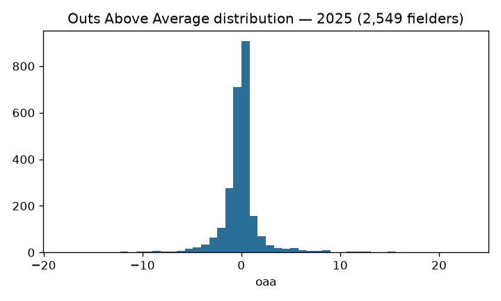

# MLB fielding models: OAA + catcher framing

## Overview

Two surfaces on `mlb_fielding_models`: **Outs Above Average** over balls in
play and **catcher framing** (called-strike value above average at the zone
edges).

## Data & methodology

Baseball Savant balls-in-play via sdv-py's `mlb_fielding_oaa` /
`mlb_catcher_framing`. The public feed lacks fielder start coordinates, so
OAA here conditions on batted-ball properties and fielder identity rather
than true opportunity geometry — a **feature-capped ceiling that is priced
into the gates** (OAA full-season Pearson vs live ≥ 0.55; framing ≥ 0.40)
instead of hidden.

## Evaluation (2025, computed from the published asset)

2,549 fielders scored.

## Reproducibility

`scripts/mlb_models.sh 04` → `mlb_model_publish fielding`. Card:
[`../../mlb/fielding_models/mlb_fielding_models_card.json`](../../mlb/fielding_models/mlb_fielding_models_card.json).

## Limitations

The registry records what is deliberately NOT published from this family
(catcher throwing/blocking, baserunning, SB value): live floors of 0.03-0.073
against 0.80+ design targets — data-ceiling-limited, recorded so nobody
"finds" the gap.

## Avenues for improvement & open issues

- **The recorded data ceiling** — no fielder start coordinates in the public
  feed caps OAA at feature-capped fidelity (gates priced accordingly); a
  positioning proxy (batted-ball-conditional average start by position) is
  the plausible next lever.
- **Known issue:** catcher throwing/blocking, baserunning, and SB value are
  deliberately unpublished (live floors 0.03-0.073 vs 0.80+ targets) — a
  narration-coverage fix upstream is the unblocking event.
