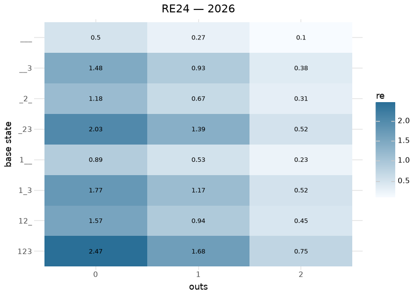
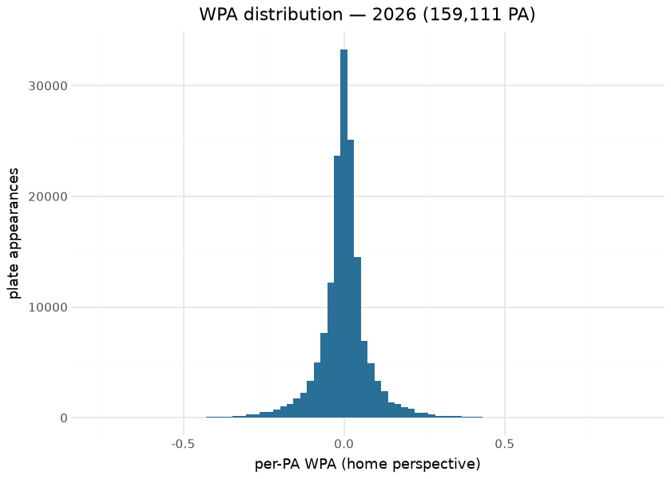

# MLB game state — RE24, Win Expectancy, WPA

The game-state family publishes the three classical baseball state-value
surfaces on the `mlb_game_state` release tag: the **RE24 matrix**
(expected runs to the end of the inning for each of the 24 base-out
states), a **win expectancy table** over inning / score-differential /
base-out buckets, and per-plate-appearance **WPA** (the change in win
expectancy attributed to each plate appearance). They are computed by
sdv-py’s `mlb_run_expectancy` / `mlb_win_expectancy` over
statsapi.mlb.com regular-season play-by-play and committed per season
under `mlb/game_state/`.

These are **empirical conditional means over observed states** — the
“model” is the state definition and the estimator. That design choice
buys two things: the surfaces are assumption-free (no parametric form to
misfit), and their internal accounting is *exactly* checkable. This
document runs those checks at render time from the committed parquet —
the WPA zero-sum identity, the RE24 monotonicity structure, and the
stability of the run environment across seasons.

There is deliberately no feature-importance or SHAP section here: with
no fitted coefficients or trees, attribution reduces to the state
definition itself. The nearest analogue — how much each dimension of the
state moves the estimate — is exactly what the heatmaps below show.

## Training data

| Committed game-state assets, by season |  |  |  |  |
|----|----|----|----|----|
| statsapi.mlb.com regular-season play-by-play; computed at render time |  |  |  |  |
| season | games | plate_appearances | re24_states | we_buckets |
| 2020 | 898 | 67,701 | 24 | 4434 |
| 2026 | 2069 | 159,111 | 24 | 4923 |
| 2018 | 2431 | 188,172 | 24 | 4978 |
| 2016 | 2428 | 187,517 | 24 | 4997 |
| 2021 | 2429 | 185,215 | 24 | 5079 |
| 2023 | 2430 | 187,451 | 24 | 5062 |
| 2022 | 2430 | 184,985 | 24 | 4943 |
| 2017 | 2430 | 188,126 | 24 | 4974 |
| 2019 | 2429 | 189,617 | 24 | 5055 |
| 2025 | 2430 | 186,115 | 24 | 5003 |
| 2024 | 2429 | 185,540 | 24 | 4985 |
| 2015 | 2429 | 186,878 | 24 | 5023 |

&#10;

Every season from the first committed year to the present is rebuilt by
the daily in-season cron. 2020’s short season is visibly thinner and its
WE buckets are correspondingly noisier — and as of 2026-09-02 that is
**carried in the data** rather than left for the reader to infer: both
state-bucket tables ship the bucket count `n` and a `thin` flag.

## How thin is thin? (the threshold is measured, not chosen)

A bucket flagged `thin` is one whose win-expectancy estimate does not
reproduce across seasons. The cut is derived by asking exactly that: for
every state bucket, how far apart are the same bucket’s WE estimates in
adjacent full seasons?

| Why the thin cut sits at n = 50 |  |  |
|----|----|----|
| same bucket, adjacent full seasons — disagreement more than doubles below n=50 |  |  |
| bucket size | buckets | mean \|dWE\| vs next season |
| \<10 | 22066 | 0.1260 |
| 10-25 | 8717 | 0.0823 |
| 25-50 | 4686 | 0.0586 |
| 50-100 | 3791 | 0.0429 |
| 100-200 | 2468 | 0.0312 |
| 200+ | 1336 | 0.0296 |

&#10;

As bucket size falls through 50, a bucket’s disagreement with its own
next-season value roughly doubles off the large-bucket floor (~.03), so
50 is where the estimate stops being reusable. Applying it per season
shows how far outside the norm 2020 sits:

| Thin state buckets by season (n \< 50) |  |  |  |
|----|----|----|----|
| 2020's 60-game season is the outlier the flag exists to mark |  |  |  |
| season | buckets | median n | share thin |
| 2015 | 5023 | 11 | 82.2% |
| 2016 | 4997 | 11 | 81.8% |
| 2017 | 4974 | 12 | 81.2% |
| 2018 | 4978 | 12 | 81.4% |
| 2019 | 5055 | 11 | 81.2% |
| 2020 | 4434 | 5 | 93.1% |
| 2021 | 5079 | 11 | 82.1% |
| 2022 | 4943 | 11 | 81.7% |
| 2023 | 5062 | 11 | 81.6% |
| 2024 | 4985 | 11 | 81.8% |
| 2025 | 5003 | 11 | 81.5% |
| 2026 | 4923 | 10 | 83.2% |

&#10;

2020 carries a median bucket of 5 plate appearances against 11 in a full
season, and ~93% of its buckets thin against ~82%. The flag does not
repair 2020 — nothing can, the games were not played — it makes the
difference visible to a consumer who would otherwise average the two
together.

## The RE24 surface

The matrix reproduces the canonical structure — monotone in baserunners,
decreasing in outs — and the anchor-state series tracks the league run
environment (the publish gate anchors the matrix against the Tango
run-expectancy tables at max abs diff ≤ 0.05).

| RE24 structural sanity, all committed seasons   |               |
|-------------------------------------------------|---------------|
| structural check                                | share passing |
| RE decreasing in outs (per base state × season) | 100.0%        |

&#10;

## Win expectancy

The surface fans out with innings exactly as it should: a one-run lead
in the first is worth ~60%, the same lead in the ninth ~85%+. The
publish gate validates the derived per-PA WPA against statsapi’s own win
probability at Spearman ≥ 0.95.

## Leverage index

Leverage index answers “how much is this state capable of swinging the
game?” — the expected absolute win-expectancy change over the outcomes
that actually follow this state, normalized so the league-average plate
appearance is 1.0. It ships as `mlb_leverage_index` on the WE table’s
own state-bucket key (and with the same `n` / `thin` columns), so WPA
and LI join without a second derivation.

<strong>Pending republish.</strong> the <code>mlb_leverage_index</code> stem lands with the next rebuild. Validated on real 2024 statsapi play-by-play at build time: <strong>PA-weighted mean LI = 1.0000</strong> (1.0 by construction), range 0.00&ndash;13.87, and late-and-close states (inning &ge; 8, margin &le; 1 run, non-thin) average <strong>1.52</strong> against <strong>0.80</strong> for early lopsided ones.

The normalization is **PA-weighted**: the average *plate appearance* has
LI 1.0, not the average *bucket*. The unweighted mean across buckets is
far higher (~1.8 in 2024) because high-leverage states are numerous but
seldom occur — so a naive `mean(leverage_index) == 1` check looks like a
bug and is not one. Bucket-level LI is also noisier than the WE it
derives from (it is a second moment of the same counts), which is
exactly why the `thin` flag travels with it.

## Evaluation — the WPA accounting identity

WPA’s defining property is that it is a **zero-sum credit ledger**:
summed over a game, home-perspective WPA must equal ±0.5 (start at 50%,
end at 0 or 100%). This is checked here over every committed season:

| Per-game WPA sum identity — \|Σ wpa\| vs 0.5 |  |  |  |
|----|----|----|----|
| exact accounting check over every committed season |  |  |  |
| season | games | identity_MAE | identity_max |
| 2015 | 2429 | 0.000000 | 0.000000 |
| 2016 | 2428 | 0.000000 | 0.000000 |
| 2017 | 2430 | 0.000000 | 0.000000 |
| 2018 | 2431 | 0.000000 | 0.000000 |
| 2019 | 2429 | 0.000000 | 0.000000 |
| 2020 | 898 | 0.000000 | 0.000000 |
| 2021 | 2429 | 0.000000 | 0.000000 |
| 2022 | 2430 | 0.000000 | 0.000000 |
| 2023 | 2430 | 0.000000 | 0.000000 |
| 2024 | 2429 | 0.000000 | 0.000000 |
| 2025 | 2430 | 0.000000 | 0.000000 |
| 2026 | 2069 | 0.000000 | 0.000000 |

&#10;

A mean identity error at (or numerically indistinguishable from) zero in
every season is the strongest possible statement about internal
consistency: the ledger balances game by game, not just on average. The
long tails of the per-PA distribution are the leverage plays — walk-offs
and late-inning homers — exactly the events WPA exists to weight.

## Provenance & reproducibility

- **Built from:** statsapi.mlb.com regular-season play-by-play, seasons
  in the table above, by sdv-py’s `mlb_run_expectancy` /
  `mlb_win_expectancy`.
- **Committed at:** `mlb/game_state/parquet/` (this document reads only
  those files); published to the `mlb_game_state` release tag;
  per-publish metadata in
  [`../../mlb/game_state/mlb_game_state_card.json`](../../mlb/game_state/mlb_game_state_card.json).
- **Pipeline:** `scripts/mlb_models.sh 01` → stage
  `python/mlb_model_01_game_state.py` (`mlb_models_cron.yml`, daily
  in-season). Single home: `models/manifest.yaml`.
- **Rebuild this document:** `scripts/render_model_docs.sh` (Quarto →
  GFM; this repo’s `.venv` via `QUARTO_PYTHON`; `uv sync --group docs`).

## Avenues for improvement & open issues

- **Era/park variants** — league-average tables hide park and era
  structure a consumer may want; a park-adjusted variant is cheap from
  the same substrate. Scoped but deliberately not built here: per-park
  state buckets are ~1/30th the count of these, so the `thin` discipline
  introduced below would dominate the result. It needs a park-factor
  input and a bucket-collapsing scheme (park x base-out, pooling
  inning/score) before it is publishable.
- **Resolved (2026-09-02, PR \#13):** leverage index is published as
  `mlb_leverage_index`, on the WE table’s own state-bucket key, carrying
  `n` and `thin`. Validated on real 2024 play-by-play: PA-weighted mean
  LI 1.0000, late-and-close states 1.52 against 0.80 for early lopsided
  ones.
- **Resolved (2026-09-02, PR \#13):** the WE and leverage tables carry
  the bucket count `n` and a `thin` flag (`n < 50`), so 2020’s short
  season is marked in the data. The threshold is measured —
  adjacent-season WE disagreement is .0586 at n=25-50 against .0296 at
  n\>=200 — and 2020 shows 93.1% thin buckets (median n=5) against
  ~81.5% (median n=11) in a full season. Both are recomputed at render
  time above.
