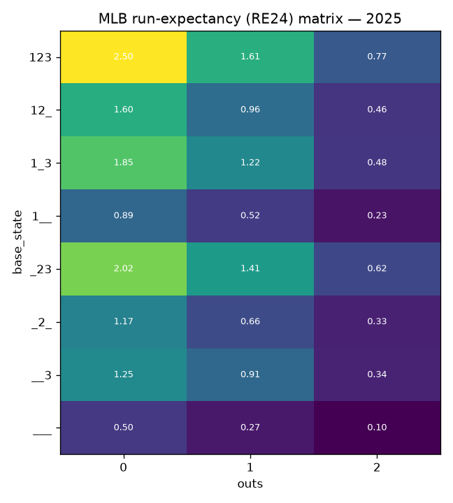
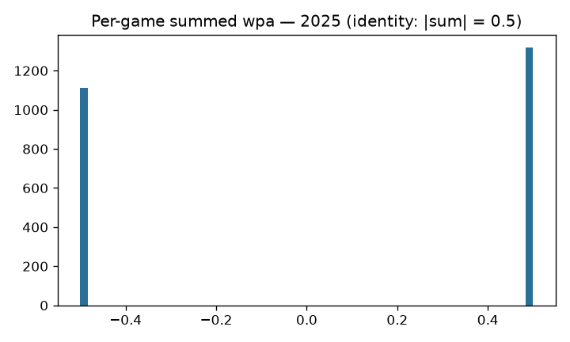

# MLB game state: RE24 / Win Expectancy / WPA

## Overview

The game-state family publishes the three classical baseball state-value
surfaces on `mlb_game_state`: the **RE24 matrix** (expected runs to end of
inning for each of the 24 base-out states), a **win-expectancy table** over
inning/score/state buckets, and per-plate-appearance **WPA** (the change in
win expectancy attributed to each PA).

## Data & methodology

Computed by sdv-py's `mlb_run_expectancy` / `mlb_win_expectancy` over
statsapi.mlb.com regular-season play-by-play, seasons 2015-present. These are
empirical conditional means over observed states — the "model" is the state
definition and the estimator, which makes the identity checks below exact
rather than approximate.

## Evaluation (2025, computed from the published assets)

- RE24 matrix: 24 base-out states.
- WPA: 186,115 plate appearances; **per-game WPA sum
  identity MAE = 0.0** — every
  game's WPA sums to exactly ±0.5, the accounting identity that makes WPA a
  zero-sum credit ledger. Publish gates additionally anchor RE24 against the
  Tango run-expectancy tables (max abs diff ≤ 0.05) and WPA against
  statsapi's own WP (Spearman ≥ 0.95).

## Reproducibility

`scripts/mlb_models.sh 01` → `mlb_model_publish game-state`
(`mlb_models_cron.yml`, daily in-season). Card:
[`../../mlb/game_state/mlb_game_state_card.json`](../../mlb/game_state/mlb_game_state_card.json).

## Limitations

League-average state values: no batter/pitcher identity, park, or era
weighting within a season — that is what makes them the neutral baseline the
player-level families measure against.

## Avenues for improvement & open issues

- **Era/park variants** — league-average tables hide park and era structure a
  consumer may want; a park-adjusted variant is cheap from the same substrate.
- **Known issue:** 2020's short season produces visibly thinner WE buckets;
  the table carries it without a flag.
