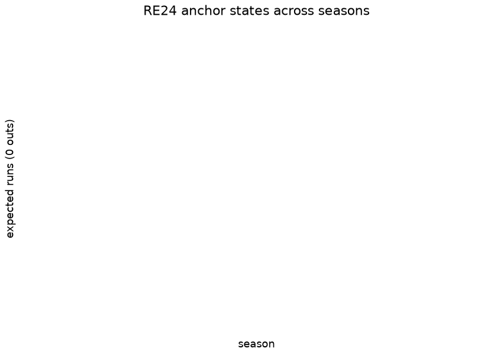

# MLB game state — RE24, Win Expectancy, WPA

The game-state family publishes the three classical baseball state-value
surfaces on the `mlb_game_state` release tag: the **RE24 matrix**
(expected runs to the end of the inning for each of the 24 base-out
states), a **win expectancy table** over inning / score-differential /
base-out buckets, and per-plate-appearance **WPA** (the change in win
expectancy attributed to each plate appearance). They are computed by
sdv-py’s `mlb_run_expectancy` / `mlb_win_expectancy` over
statsapi.mlb.com regular-season play-by-play and committed per season
under `mlb/game_state/`.

These are **empirical conditional means over observed states** — the
“model” is the state definition and the estimator. That design choice
buys two things: the surfaces are assumption-free (no parametric form to
misfit), and their internal accounting is *exactly* checkable. This
document runs those checks at render time from the committed parquet —
the WPA zero-sum identity, the RE24 monotonicity structure, and the
stability of the run environment across seasons.

There is deliberately no feature-importance or SHAP section here: with
no fitted coefficients or trees, attribution reduces to the state
definition itself. The nearest analogue — how much each dimension of the
state moves the estimate — is exactly what the heatmaps below show.

## Training data

| Committed game-state assets, by season |  |  |  |  |
|----|----|----|----|----|
| statsapi.mlb.com regular-season play-by-play; computed at render time |  |  |  |  |
| season | games | plate_appearances | re24_states | we_buckets |
| 2016 | 2428 | 187,517 | 24 | 4997 |
| 2022 | 2430 | 184,985 | 24 | 4943 |
| 2025 | 2430 | 186,115 | 24 | 5003 |
| 2024 | 2429 | 185,540 | 24 | 4985 |
| 2023 | 2430 | 187,451 | 24 | 5062 |
| 2017 | 2430 | 188,126 | 24 | 4974 |
| 2018 | 2431 | 188,172 | 24 | 4978 |
| 2026 | 2069 | 159,111 | 24 | 4923 |
| 2015 | 2429 | 186,878 | 24 | 5023 |
| 2021 | 2429 | 185,215 | 24 | 5079 |
| 2019 | 2429 | 189,617 | 24 | 5055 |
| 2020 | 898 | 67,701 | 24 | 4434 |

&#10;

Every season from the first committed year to the present is rebuilt by
the daily in-season cron; 2020’s short season is visibly thinner and its
WE buckets are correspondingly noisier (a known limitation carried
without a flag in the data itself).

## The RE24 surface

The matrix reproduces the canonical structure — monotone in baserunners,
decreasing in outs — and the anchor-state series tracks the league run
environment (the publish gate anchors the matrix against the Tango
run-expectancy tables at max abs diff ≤ 0.05).

| RE24 structural sanity, all committed seasons   |               |
|-------------------------------------------------|---------------|
| structural check                                | share passing |
| RE decreasing in outs (per base state × season) | 100.0%        |

&#10;

## Win expectancy

The surface fans out with innings exactly as it should: a one-run lead
in the first is worth ~60%, the same lead in the ninth ~85%+. The
publish gate validates the derived per-PA WPA against statsapi’s own win
probability at Spearman ≥ 0.95.

## Evaluation — the WPA accounting identity

WPA’s defining property is that it is a **zero-sum credit ledger**:
summed over a game, home-perspective WPA must equal ±0.5 (start at 50%,
end at 0 or 100%). This is checked here over every committed season:

| Per-game WPA sum identity — \|Σ wpa\| vs 0.5 |  |  |  |
|----|----|----|----|
| exact accounting check over every committed season |  |  |  |
| season | games | identity_MAE | identity_max |
| 2015 | 2429 | 0.000000 | 0.000000 |
| 2016 | 2428 | 0.000000 | 0.000000 |
| 2017 | 2430 | 0.000000 | 0.000000 |
| 2018 | 2431 | 0.000000 | 0.000000 |
| 2019 | 2429 | 0.000000 | 0.000000 |
| 2020 | 898 | 0.000000 | 0.000000 |
| 2021 | 2429 | 0.000000 | 0.000000 |
| 2022 | 2430 | 0.000000 | 0.000000 |
| 2023 | 2430 | 0.000000 | 0.000000 |
| 2024 | 2429 | 0.000000 | 0.000000 |
| 2025 | 2430 | 0.000000 | 0.000000 |
| 2026 | 2069 | 0.000000 | 0.000000 |

&#10;

A mean identity error at (or numerically indistinguishable from) zero in
every season is the strongest possible statement about internal
consistency: the ledger balances game by game, not just on average. The
long tails of the per-PA distribution are the leverage plays — walk-offs
and late-inning homers — exactly the events WPA exists to weight.

## Provenance & reproducibility

- **Built from:** statsapi.mlb.com regular-season play-by-play, seasons
  in the table above, by sdv-py’s `mlb_run_expectancy` /
  `mlb_win_expectancy`.
- **Committed at:** `mlb/game_state/parquet/` (this document reads only
  those files); published to the `mlb_game_state` release tag;
  per-publish metadata in
  [`../../mlb/game_state/mlb_game_state_card.json`](../../mlb/game_state/mlb_game_state_card.json).
- **Pipeline:** `scripts/mlb_models.sh 01` → stage
  `python/mlb_model_01_game_state.py` (`mlb_models_cron.yml`, daily
  in-season). Single home: `models/manifest.yaml`.
- **Rebuild this document:** `scripts/render_model_docs.sh` (Quarto →
  GFM; this repo’s `.venv` via `QUARTO_PYTHON`; `uv sync --group docs`).

## Avenues for improvement & open issues

- **Era/park variants** — league-average tables hide park and era
  structure a consumer may want; a park-adjusted variant is cheap from
  the same substrate.
- **Leverage index** — the WE table already contains everything needed
  to publish LI alongside WPA; it is the most-requested missing column.
- **Known issue:** 2020’s short season produces visibly thinner WE
  buckets; the table carries it without a flag.
