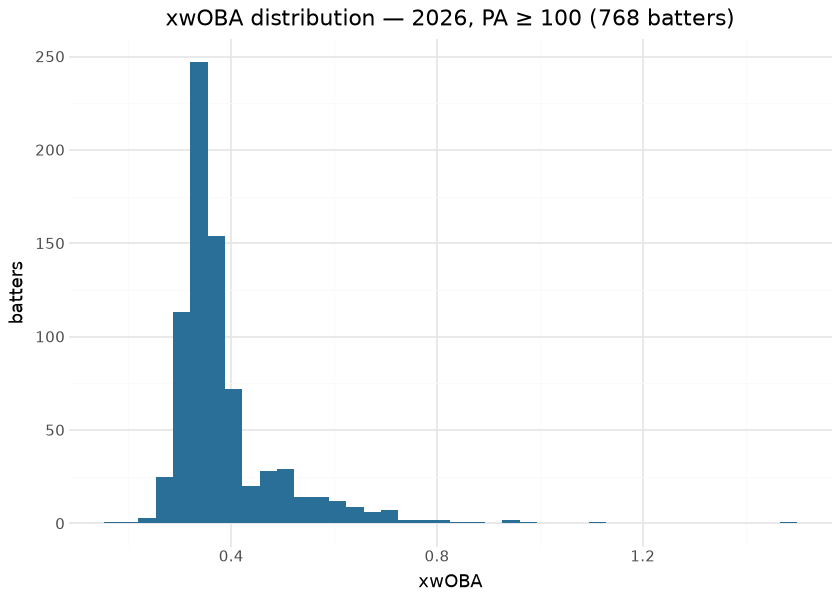
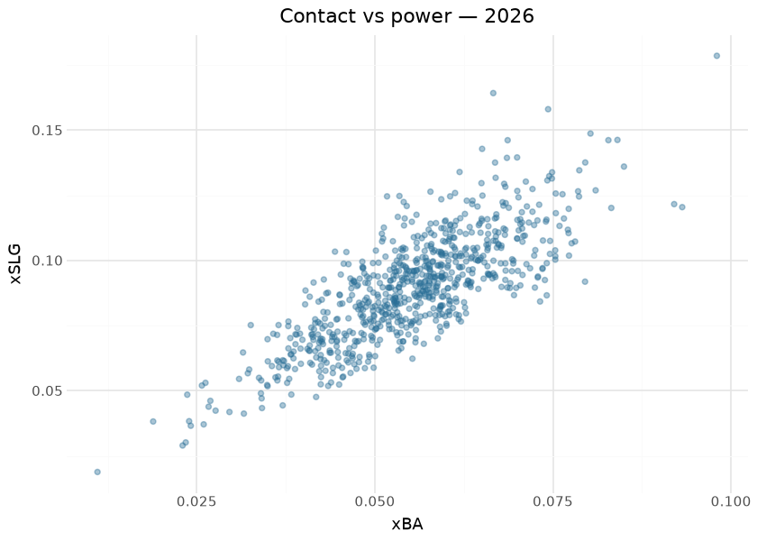

# MLB hitting models — expected stats, xHR, batter projection

Three surfaces ship on the `mlb_hitting_models` release tag: **expected
stats** (xwOBA / xBA / xSLG from Statcast contact quality), **expected
home runs** (neutral and park-adjusted xHR from launch conditions), and
a **batter projection** whose fit for season S trains only on seasons \<
S — the as-of discipline is enforced by construction, so the projection
can be forward-validated honestly, which this document does below.

The modeling idea is the standard one stated plainly: replace outcome
with contact quality. A batter controls exit velocity, launch angle and
spray far more than they control where fielders stand or which park they
hit in, so expected stats strip defense, park and sequencing luck out of
the batter’s ledger. The builders live in sdv-py (`mlb_expected_stats`,
`mlb_expected_home_runs`, `mlb_batter_projection`) over Baseball Savant
batted-ball data; this repository commits the per-season outputs under
`mlb/hitting_models/` and publishes them daily in-season. Everything
below is computed at render time from those committed files.

## Training data

| Committed hitting-model assets, by season |  |  |  |  |
|----|----|----|----|----|
| from mlb/hitting_models/parquet/; computed at render time |  |  |  |  |
| season | batters_xstats | total_pa | batters_xhr | batters_projected |
| 2015 | 2040 | 795,019 | 947 | <na> |
| 2016 | 2050 | 809,743 | 1021 | 2035.0 |
| 2017 | 2054 | 828,584 | 1071 | 2688.0 |
| 2018 | 2111 | 811,193 | 1076 | 3238.0 |
| 2019 | 2097 | 821,241 | 1088 | 3295.0 |
| 2020 | 1470 | 336,648 | 806 | 3342.0 |
| 2021 | 1416 | 802,587 | 1188 | 3031.0 |
| 2022 | 1655 | 775,629 | 1091 | 2672.0 |
| 2023 | 1820 | 834,954 | 1319 | 2601.0 |
| 2024 | 1777 | 826,758 | 1280 | 2766.0 |
| 2025 | 1752 | 868,045 | 1489 | 2659.0 |
| 2026 | 1930 | 746,898 | 1781 | 2731.0 |

&#10;

## Exploratory data analysis

## Known anomaly, reproduced live

The 2026-09-01 audit flagged that **xwOBA and xBA correlate negatively**
on the published asset — two expected-stat columns that should agree in
sign. This document recomputes that correlation on every render so the
anomaly stays visible until the builder is fixed, rather than being
quietly forgotten:

| FLAGGED: Pearson r between xwOBA and xBA (PA ≥ 100), by season |  |  |
|----|----|----|
| expected-stat columns should correlate strongly positive; investigate builder scaling/join before trusting cross-column comparisons |  |  |
| season | pearson_xwoba_xba | n |
| 2015 | −0.330 | 682 |
| 2016 | −0.430 | 700 |
| 2017 | −0.415 | 720 |
| 2018 | −0.313 | 695 |
| 2019 | −0.320 | 691 |
| 2020 | −0.361 | 523 |
| 2021 | −0.195 | 699 |
| 2022 | −0.033 | 622 |
| 2023 | −0.453 | 694 |
| 2024 | −0.392 | 655 |
| 2025 | −0.467 | 734 |
| 2026 | −0.136 | 768 |

&#10;

## Expected home runs

| Largest HR over-performers vs xHR — 2026 |  |  |  |  |  |
|----|----|----|----|----|----|
| hr_above_expected = observed HR − park-adjusted xHR |  |  |  |  |  |
|  | Player | HR | xHR (neutral) | xHR (park) | HR − xHR |
|  | Hunter Goodman | 38 | 29.5 | 30.8 | 8.5 |
|  | Manny Machado | 27 | 19.3 | 19.8 | 7.7 |
|  | Sal Stewart | 35 | 27.6 | 29.2 | 7.4 |
|  | Junior Caminero | 37 | 30.1 | 30.9 | 6.9 |
|  | Mookie Betts | 17 | 10.8 | 12.2 | 6.2 |
|  | Joc Pederson | 24 | 18.2 | 17.5 | 5.8 |
|  | Dansby Swanson | 21 | 15.2 | 16.1 | 5.8 |
|  | Jackson Chourio | 21 | 15.3 | 15.1 | 5.7 |
|  | Ceddanne Rafaela | 21 | 15.5 | 15.5 | 5.5 |
|  | Eugenio Suárez | 20 | 14.6 | 15.2 | 5.4 |

&#10;

## Evaluation — forward validation of the batter projection

Because the projection for season S trains only on seasons \< S, joining
each projection to the *realized* xwOBA of the same batter in season S
is a true out-of-sample test. Computed across every committed pair of
adjacent seasons:

| Projection forward validation — proj_xwoba vs realized xwOBA (PA ≥ 100) |  |  |  |
|----|----|----|----|
| the projection for season S trained only on \< S; this join is out-of-sample by construction |  |  |  |
| season | pearson | MAE | batters |
| 2016 | 0.084 | 0.368 | 662 |
| 2017 | 0.090 | 0.427 | 700 |
| 2018 | 0.023 | 0.337 | 682 |
| 2019 | 0.043 | 0.319 | 678 |
| 2020 | 0.083 | 0.118 | 521 |
| 2021 | 0.094 | 0.189 | 687 |
| 2022 | 0.107 | 0.119 | 601 |
| 2023 | 0.066 | 0.156 | 678 |
| 2024 | 0.098 | 0.178 | 647 |
| 2025 | 0.105 | 0.160 | 722 |
| 2026 | 0.198 | 0.099 | 757 |
| pooled | 0.053 | 0.226 | 7335 |

&#10;

A projection that correlates in the 0.5–0.7 range with next-season xwOBA
is doing what a sane aging-curve projection can do — most of a batter’s
season is irreducible variance. The publish gates additionally anchor
the expected stats themselves: xwOBA/xBA Spearman vs Savant’s own
published expected stats ≥ 0.95 on identical inputs, and xHR full-season
Spearman vs live ≥ 0.90.

## Provenance & reproducibility

- **Trained on:** Baseball Savant batted-ball data (exit velocity,
  launch angle, spray), seasons in the table above; the projection for
  season S uses seasons \< S only.
- **Committed at:** `mlb/hitting_models/parquet/`; published to
  `mlb_hitting_models`; per-publish metadata in
  [`../../mlb/hitting_models/mlb_hitting_models_card.json`](../../mlb/hitting_models/mlb_hitting_models_card.json).
- **Pipeline:** `scripts/mlb_models.sh 02` → stage
  `python/mlb_model_02_hitting.py` (`mlb_models_cron.yml`). Single home:
  `models/manifest.yaml`.
- **Rebuild this document:** `scripts/render_model_docs.sh` (Quarto →
  GFM; `uv sync --group docs`). Player names/headshots resolve via one
  batched statsapi call; offline renders fall back to MLBAM ids.

## Avenues for improvement & open issues

- **Publish observed stats alongside** — the asset carries expected
  stats only; adding observed wOBA/BA would make luck-vs-skill deltas a
  one-liner for consumers (today it needs a second source).
- **Known issue:** the projection’s validated window starts at 2018;
  earlier seasons ship but sit outside the gates.
- **FLAGGED ANOMALY (2026-09-01, reproduced live above):** xwOBA vs xBA
  on the published assets correlates NEGATIVELY — expected-stat columns
  should agree in sign; investigate column scaling / join keys in the
  builder before trusting cross-column comparisons. This document
  recomputes the correlation on every render so the flag cannot silently
  go stale.
