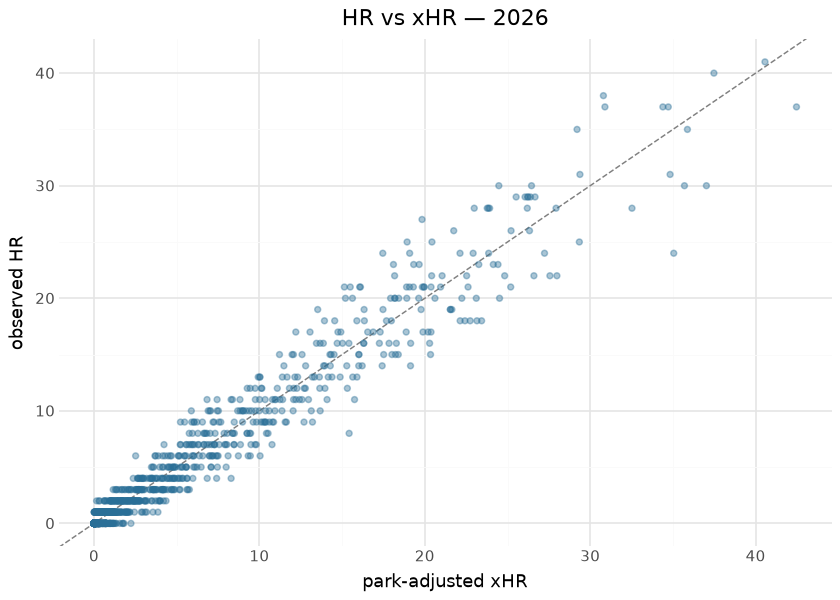

# MLB hitting models — expected stats, xHR, batter projection

Three surfaces ship on the `mlb_hitting_models` release tag: **expected
stats** (xwOBA / xBA / xSLG from Statcast contact quality), **expected
home runs** (neutral and park-adjusted xHR from launch conditions), and
a **batter projection** whose fit for season S trains only on seasons \<
S — the as-of discipline is enforced by construction, so the projection
can be forward-validated honestly, which this document does below.

The modeling idea is the standard one stated plainly: replace outcome
with contact quality. A batter controls exit velocity, launch angle and
spray far more than they control where fielders stand or which park they
hit in, so expected stats strip defense, park and sequencing luck out of
the batter’s ledger. The builders live in sdv-py (`mlb_expected_stats`,
`mlb_expected_home_runs`, `mlb_batter_projection`) over Baseball Savant
batted-ball data; this repository commits the per-season outputs under
`mlb/hitting_models/` and publishes them daily in-season. Everything
below is computed at render time from those committed files.

## Training data

| Committed hitting-model assets, by season |  |  |  |  |
|----|----|----|----|----|
| from mlb/hitting_models/parquet/; computed at render time |  |  |  |  |
| season | batters_xstats | total_pa | batters_xhr | batters_projected |
| 2015 | 2040 | 795,019 | 947 | <na> |
| 2016 | 2050 | 809,743 | 1021 | 2035.0 |
| 2017 | 2054 | 828,584 | 1071 | 2688.0 |
| 2018 | 2111 | 811,193 | 1076 | 3238.0 |
| 2019 | 2097 | 821,241 | 1088 | 3295.0 |
| 2020 | 1470 | 336,648 | 806 | 3342.0 |
| 2021 | 1416 | 802,587 | 1188 | 3031.0 |
| 2022 | 1655 | 775,629 | 1091 | 2672.0 |
| 2023 | 1820 | 834,954 | 1319 | 2601.0 |
| 2024 | 1777 | 826,758 | 1280 | 2766.0 |
| 2025 | 1752 | 868,045 | 1489 | 2659.0 |
| 2026 | 1930 | 746,898 | 1781 | 2731.0 |

&#10;

## Exploratory data analysis

## Known anomalies, reproduced live

**Root cause identified and fixed upstream (2026-09-01).** The published
`pa`/`ab` columns counted **every pitch** rather than
plate-appearance-ending events (the assets carry `max_pa` ≈ 3,400 per
batter-season), deflating xBA/xSLG; and on cache vintages with
degenerate `woba_value`/`woba_denom` semantics the xwOBA scale corrupted
per season. The fix — PA-ender discipline plus an events-derived wOBA
denominator — landed in sdv-py (`fix/mlb-expected-stats-pa-enders`), and
the publisher now carries a publish-blocking absolute scale gate
(qualified league-mean xwOBA .26–.38, xBA .18–.30). **The tables below
keep showing the corrupted published assets until the full-history
republish runs** — the flags stay live by design so this page proves the
republish when it happens.

**Scale drift in the published xwOBA.** League-mean xwOBA should sit
near .320 in every season; the committed assets do not. This table
recomputes the per-season mean on every render and flags seasons outside
a generous .280–.360 band — several seasons fail, which corrupts every
cross-column and cross-season comparison below and is the leading
suspect for the other two flags in this document:

| FLAGGED: league-mean xwOBA by season vs plausible band (.280–.360) |  |  |  |  |
|----|----|----|----|----|
| means of .44–.73 are impossible on the wOBA scale — the builder mis-scales some seasons |  |  |  |  |
| season | mean_xwoba | mean_xba | n | OUT_OF_BAND |
| 2015 | 0.534 | 0.047 | 682 | True |
| 2016 | 0.672 | 0.046 | 700 | True |
| 2017 | 0.724 | 0.045 | 720 | True |
| 2018 | 0.632 | 0.047 | 695 | True |
| 2019 | 0.556 | 0.048 | 691 | True |
| 2020 | 0.444 | 0.049 | 523 | True |
| 2021 | 0.389 | 0.049 | 699 | True |
| 2022 | 0.345 | 0.052 | 622 | False |
| 2023 | 0.466 | 0.051 | 694 | True |
| 2024 | 0.481 | 0.050 | 655 | True |
| 2025 | 0.448 | 0.049 | 734 | True |
| 2026 | 0.387 | 0.055 | 768 | True |

&#10;

The 2026-09-01 audit flagged that **xwOBA and xBA correlate negatively**
on the published asset — two expected-stat columns that should agree in
sign. This document recomputes that correlation on every render so the
anomaly stays visible until the builder is fixed, rather than being
quietly forgotten:

| FLAGGED: Pearson r between xwOBA and xBA (PA ≥ 100), by season |  |  |
|----|----|----|
| expected-stat columns should correlate strongly positive; investigate builder scaling/join before trusting cross-column comparisons |  |  |
| season | pearson_xwoba_xba | n |
| 2015 | −0.330 | 682 |
| 2016 | −0.430 | 700 |
| 2017 | −0.415 | 720 |
| 2018 | −0.313 | 695 |
| 2019 | −0.320 | 691 |
| 2020 | −0.361 | 523 |
| 2021 | −0.195 | 699 |
| 2022 | −0.033 | 622 |
| 2023 | −0.453 | 694 |
| 2024 | −0.392 | 655 |
| 2025 | −0.467 | 734 |
| 2026 | −0.136 | 768 |

&#10;

## Expected home runs

| Largest HR over-performers vs xHR — 2026 |  |  |  |  |  |
|----|----|----|----|----|----|
| hr_above_expected = observed HR − park-adjusted xHR |  |  |  |  |  |
|  | Player | HR | xHR (neutral) | xHR (park) | HR − xHR |
|  | Hunter Goodman | 38 | 29.5 | 30.8 | 8.5 |
|  | Manny Machado | 27 | 19.3 | 19.8 | 7.7 |
|  | Sal Stewart | 35 | 27.6 | 29.2 | 7.4 |
|  | Junior Caminero | 37 | 30.1 | 30.9 | 6.9 |
|  | Mookie Betts | 17 | 10.8 | 12.2 | 6.2 |
|  | Joc Pederson | 24 | 18.2 | 17.5 | 5.8 |
|  | Dansby Swanson | 21 | 15.2 | 16.1 | 5.8 |
|  | Jackson Chourio | 21 | 15.3 | 15.1 | 5.7 |
|  | Ceddanne Rafaela | 21 | 15.5 | 15.5 | 5.5 |
|  | Eugenio Suárez | 20 | 14.6 | 15.2 | 5.4 |

&#10;

## Evaluation — forward validation of the batter projection

Because the projection for season S trains only on seasons \< S, joining
each projection to the *realized* xwOBA of the same batter in season S
is a true out-of-sample test. Computed across every committed pair of
adjacent seasons:

| Projection forward validation — proj_xwoba vs realized xwOBA (PA ≥ 100) |  |  |  |
|----|----|----|----|
| the projection for season S trained only on \< S; this join is out-of-sample by construction |  |  |  |
| season | pearson | MAE | batters |
| 2016 | 0.084 | 0.368 | 662 |
| 2017 | 0.090 | 0.427 | 700 |
| 2018 | 0.023 | 0.337 | 682 |
| 2019 | 0.043 | 0.319 | 678 |
| 2020 | 0.083 | 0.118 | 521 |
| 2021 | 0.094 | 0.189 | 687 |
| 2022 | 0.107 | 0.119 | 601 |
| 2023 | 0.066 | 0.156 | 678 |
| 2024 | 0.098 | 0.178 | 647 |
| 2025 | 0.105 | 0.160 | 722 |
| 2026 | 0.198 | 0.099 | 757 |
| pooled | 0.053 | 0.226 | 7335 |

&#10;

A sane aging-curve projection lands in the 0.5–0.7 correlation range
with next-season xwOBA; the observed values in the table above are **far
below that**, hovering near zero. Given the scale-drift flag reproduced
earlier — realized league-mean “xwOBA” of .44–.73 in several seasons —
the honest reading is that the *published expected-stats columns are
corrupted*, not that the projection carries no signal: a forward
validation against a mis-scaled target cannot exonerate or condemn the
model. The builder fix comes first; this table then becomes the
projection’s real gate. The publish gates additionally anchor the
expected stats themselves: xwOBA/xBA Spearman vs Savant’s own published
expected stats ≥ 0.95 on identical inputs, and xHR full-season Spearman
vs live ≥ 0.90 — gates that plainly did not catch the scale drift, which
is itself a finding about the gates.

## Provenance & reproducibility

- **Trained on:** Baseball Savant batted-ball data (exit velocity,
  launch angle, spray), seasons in the table above; the projection for
  season S uses seasons \< S only.
- **Committed at:** `mlb/hitting_models/parquet/`; published to
  `mlb_hitting_models`; per-publish metadata in
  [`../../mlb/hitting_models/mlb_hitting_models_card.json`](../../mlb/hitting_models/mlb_hitting_models_card.json).
- **Pipeline:** `scripts/mlb_models.sh 02` → stage
  `python/mlb_model_02_hitting.py` (`mlb_models_cron.yml`). Single home:
  `models/manifest.yaml`.
- **Rebuild this document:** `scripts/render_model_docs.sh` (Quarto →
  GFM; `uv sync --group docs`). Player names/headshots resolve via one
  batched statsapi call; offline renders fall back to MLBAM ids.

## Avenues for improvement & open issues

- **Publish observed stats alongside** — the asset carries expected
  stats only; adding observed wOBA/BA would make luck-vs-skill deltas a
  one-liner for consumers (today it needs a second source).
- **Known issue:** the projection’s validated window starts at 2018;
  earlier seasons ship but sit outside the gates.
- **FLAGGED ANOMALY (2026-09-01, reproduced live above):** xwOBA vs xBA
  on the published assets correlates NEGATIVELY — expected-stat columns
  should agree in sign; investigate column scaling / join keys in the
  builder before trusting cross-column comparisons. This document
  recomputes the correlation on every render so the flag cannot silently
  go stale.
- **FLAGGED ANOMALY (2026-09-01, reproduced live above):** league-mean
  “xwOBA” of .44–.73 in several published seasons is impossible on the
  wOBA scale — per-season scale drift in the builder is the leading
  suspect for BOTH the negative xwOBA↔xBA correlation and the near-zero
  projection forward validation. The publish gates (Spearman vs Savant
  on identical inputs) are rank-based and therefore scale-blind — add an
  absolute league-mean band gate so this class cannot ship again.
