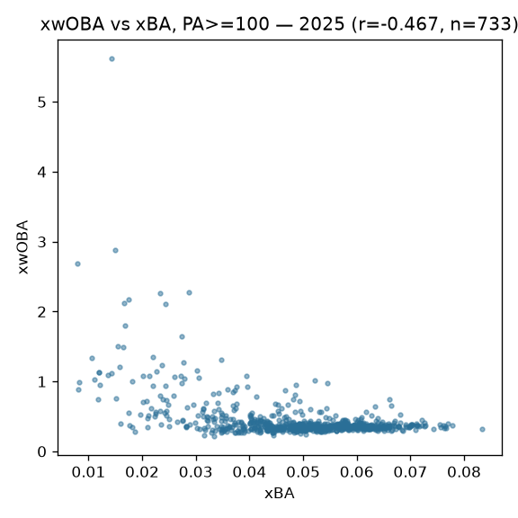

# MLB hitting models: expected stats, xHR, batter projection

## Overview

Three surfaces on `mlb_hitting_models`: **expected stats** (xwOBA/xBA from
Statcast contact quality), **expected home runs** (xHR from launch
conditions), and a **batter projection** whose fit for season S trains only on
seasons < S (as-of enforced — no leakage by construction).

## Data & feature engineering

Baseball Savant batted-ball data (exit velocity, launch angle, spray)
via sdv-py's `mlb_expected_stats` / `mlb_expected_home_runs` /
`mlb_batter_projection`. Contact quality replaces outcome — the point of
x-stats is to strip defense, park, and sequencing luck from the batter's
ledger.

## Evaluation

Publish gates: xwOBA/xBA Spearman vs Savant's own published expected stats
≥ 0.95 on identical inputs; xHR full-season Spearman vs live ≥ 0.90.
Computed from the published 2025 asset (1,752 batters, 733 with PA >= 100): xwOBA vs xBA Pearson r = **-0.4674** — an UNEXPECTED negative sign between two expected-stat columns, flagged as a potential scaling/join issue in the published asset rather than explained away (see open issues below).

## Reproducibility

`scripts/mlb_models.sh 02` → `mlb_model_publish hitting`. Card:
[`../../mlb/hitting_models/mlb_hitting_models_card.json`](../../mlb/hitting_models/mlb_hitting_models_card.json).

## Limitations

x-stats inherit Savant's tracking coverage; the projection is only validated
inside its as-of window, and the xwOBA↔wOBA gap for any one player mixes
skill regression with genuine defense/park effects.

## Avenues for improvement & open issues

- **Publish observed stats alongside** — the asset carries expected stats
  only; adding observed wOBA/BA would make luck-vs-skill deltas a one-liner
  for consumers (today it needs a second source).
- **Known issue:** the projection's validated window starts at 2018; earlier
  seasons ship but sit outside the gates.
- **FLAGGED ANOMALY (2026-09-01):** xwOBA vs xBA on the published 2025 asset
  correlates NEGATIVELY (r = -0.467) — expected-stat columns should agree in
  sign; investigate column scaling / join keys in the builder before trusting
  cross-column comparisons.
