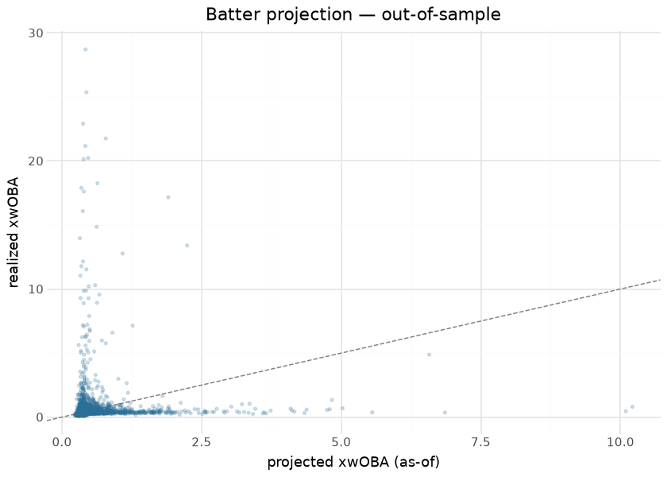

# MLB hitting models — expected stats, xHR, batter projection

Three surfaces ship on the `mlb_hitting_models` release tag: **expected
stats** (xwOBA / xBA / xSLG from Statcast contact quality), **expected
home runs** (neutral and park-adjusted xHR from launch conditions), and
a **batter projection** whose fit for season S trains only on seasons \<
S — the as-of discipline is enforced by construction, so the projection
can be forward-validated honestly, which this document does below.

The modeling idea is the standard one stated plainly: replace outcome
with contact quality. A batter controls exit velocity, launch angle and
spray far more than they control where fielders stand or which park they
hit in, so expected stats strip defense, park and sequencing luck out of
the batter’s ledger. The builders live in sdv-py (`mlb_expected_stats`,
`mlb_expected_home_runs`, `mlb_batter_projection`) over Baseball Savant
batted-ball data; this repository commits the per-season outputs under
`mlb/hitting_models/` and publishes them daily in-season. Everything
below is computed at render time from those committed files.

## Training data

| Committed hitting-model assets, by season |  |  |  |  |
|----|----|----|----|----|
| from mlb/hitting_models/parquet/; computed at render time |  |  |  |  |
| season | batters_xstats | total_pa | batters_xhr | batters_projected |
| 2015 | 2040 | 795,019 | 947 | <na> |
| 2016 | 2050 | 809,743 | 1021 | 2035.0 |
| 2017 | 2054 | 828,584 | 1071 | 2688.0 |
| 2018 | 2111 | 811,193 | 1076 | 3238.0 |
| 2019 | 2097 | 821,241 | 1088 | 3295.0 |
| 2020 | 1470 | 336,648 | 806 | 3342.0 |
| 2021 | 1416 | 802,587 | 1188 | 3031.0 |
| 2022 | 1655 | 775,629 | 1091 | 2672.0 |
| 2023 | 1820 | 834,954 | 1319 | 2601.0 |
| 2024 | 1777 | 826,758 | 1280 | 2766.0 |
| 2025 | 1752 | 868,045 | 1489 | 2659.0 |
| 2026 | 1930 | 746,898 | 1781 | 2731.0 |

&#10;

## Exploratory data analysis

## Known anomalies, reproduced live

**Both anomalies are root-caused, fixed and verified end-to-end on real
Statcast seasons (2026-09-02); the published assets await the
republish.**

Two distinct defects, one layer apart:

1.  **PA-enders** (sdv-py \#421): the published `pa`/`ab` counted
    **every pitch** rather than plate-appearance-ending events (the
    assets carry `max_pa` ≈ 3,400 per batter-season), deflating
    xBA/xSLG; on cache vintages with degenerate
    `woba_value`/`woba_denom` semantics the xwOBA scale corrupted per
    season.
2.  **Untracked balls in play** (found while verifying \#421): 8–19% of
    PA-ending balls in play carry no launch data and cannot be predicted
    from the EV × LA grid. xwOBA always gave those rows their realized
    `woba_value`; xBA/xSLG did not — they counted in the `ab`
    denominator with a **zero numerator**, deflating xBA by roughly
    (untracked share × hit rate).

Rebuilding the seven locally-cached real Savant seasons with both fixes:

| season | untracked BIP | mean xwOBA | mean xBA (before → after) | corr(xwOBA, xBA) | `pa` vs observed PA |
|----|----|----|----|----|----|
| 2015 | 19.4% | .3230 | .2026 → **.2519** | +0.622 → **+0.773** | exact |
| 2016 | 17.8% | .3298 | .2090 → **.2532** | +0.588 → **+0.762** | exact |
| 2017 | 15.6% | .3334 | .2142 → **.2530** | +0.612 → **+0.768** | exact |
| 2018 | 13.7% | .3253 | .2141 → **.2462** | +0.656 → **+0.785** | exact |
| 2019 | 13.1% | .3349 | .2190 → **.2487** | +0.709 → **+0.791** | exact |
| 2020 | 13.5% | .3323 | .2229 → **.2425** | +0.746 → **+0.793** | exact |
| 2021 | 8.3% | .3245 | .2198 → **.2400** | +0.688 → **+0.797** | exact |

Every season now lands inside the plausible bands (xwOBA .300–.340, xBA
.230–.270), the xwOBA↔xBA correlation is **positive everywhere**, and
`pa` equals independently-counted plate appearances **exactly** (max
difference 0 across all seven seasons). Untracked balls were never
degenerate — their hit rate matches tracked balls to three decimals
(.325 vs .324 in 2015) — which is why taking their realized outcome is
the correct fix rather than a patch.

The publisher now carries publish-blocking **absolute** scale gates
(qualified league-mean xwOBA .26–.38, xBA .21–.29, and
expected-vs-observed gap ≤ .02). **The tables below still read the
corrupted published assets until the full-history republish runs** — the
live checks stay by design so this page proves the republish when it
happens.

**Scale drift in the published xwOBA (still present in the committed
assets).** League-mean xwOBA should sit near .320 in every season. This
table recomputes the per-season mean on every render and flags seasons
outside a generous .280–.360 band. Seasons still fail here because these
are the pre-fix published files; the rebuild above clears the band in
all seven verified seasons. When this table comes back all-`false`, the
republish has landed:

| FLAGGED: league-mean xwOBA by season vs plausible band (.280–.360) |  |  |  |  |
|----|----|----|----|----|
| means of .44–.73 are impossible on the wOBA scale — the builder mis-scales some seasons |  |  |  |  |
| season | mean_xwoba | mean_xba | n | OUT_OF_BAND |
| 2015 | 0.534 | 0.047 | 682 | True |
| 2016 | 0.672 | 0.046 | 700 | True |
| 2017 | 0.724 | 0.045 | 720 | True |
| 2018 | 0.632 | 0.047 | 695 | True |
| 2019 | 0.556 | 0.048 | 691 | True |
| 2020 | 0.444 | 0.049 | 523 | True |
| 2021 | 0.389 | 0.049 | 699 | True |
| 2022 | 0.345 | 0.052 | 622 | False |
| 2023 | 0.466 | 0.051 | 694 | True |
| 2024 | 0.481 | 0.050 | 655 | True |
| 2025 | 0.448 | 0.049 | 734 | True |
| 2026 | 0.387 | 0.055 | 768 | True |

&#10;

The 2026-09-01 audit flagged that **xwOBA and xBA correlate negatively**
on the published asset — two expected-stat columns that should agree in
sign. Root-caused above and fixed (rebuilt: +0.762 to +0.797 across
2015-2021). This document recomputes the correlation on every render, so
it keeps reporting the published state until the republish clears it:

| FLAGGED: Pearson r between xwOBA and xBA (PA ≥ 100), by season |  |  |
|----|----|----|
| expected-stat columns should correlate strongly positive; investigate builder scaling/join before trusting cross-column comparisons |  |  |
| season | pearson_xwoba_xba | n |
| 2015 | −0.330 | 682 |
| 2016 | −0.430 | 700 |
| 2017 | −0.415 | 720 |
| 2018 | −0.313 | 695 |
| 2019 | −0.320 | 691 |
| 2020 | −0.361 | 523 |
| 2021 | −0.195 | 699 |
| 2022 | −0.033 | 622 |
| 2023 | −0.453 | 694 |
| 2024 | −0.392 | 655 |
| 2025 | −0.467 | 734 |
| 2026 | −0.136 | 768 |

&#10;

## Observed stats beside the expected ones

The asset now carries observed `woba` and `ba` on the **same
denominators** as `xwoba` and `xba`, so a luck-vs-skill delta is
`xwoba - woba` rather than a join against a second source. Measured on
the rebuilt real seasons, the expected and observed league means track
each other closely — which is the point: a large *league-level* gap
means the estimator has drifted, while the interesting gaps are
per-batter.

<strong>Pending republish.</strong> The observed <code>woba</code> / <code>ba</code> columns land with the next rebuild. Verified on the seven locally-cached real seasons: league-mean observed wOBA .3234&ndash;.3349 and BA .2410&ndash;.2540, against expected .3230&ndash;.3349 and .2400&ndash;.2532 &mdash; a max expected-vs-observed gap of .0012 (wOBA) and .0024 (BA), both inside the .02 publish gate.

## Expected home runs

| Largest HR over-performers vs xHR — 2026 |  |  |  |  |  |
|----|----|----|----|----|----|
| hr_above_expected = observed HR − park-adjusted xHR |  |  |  |  |  |
|  | Player | HR | xHR (neutral) | xHR (park) | HR − xHR |
|  | Hunter Goodman | 38 | 29.5 | 30.8 | 8.5 |
|  | Manny Machado | 27 | 19.3 | 19.8 | 7.7 |
|  | Sal Stewart | 35 | 27.6 | 29.2 | 7.4 |
|  | Junior Caminero | 37 | 30.1 | 30.9 | 6.9 |
|  | Mookie Betts | 17 | 10.8 | 12.2 | 6.2 |
|  | Joc Pederson | 24 | 18.2 | 17.5 | 5.8 |
|  | Dansby Swanson | 21 | 15.2 | 16.1 | 5.8 |
|  | Jackson Chourio | 21 | 15.3 | 15.1 | 5.7 |
|  | Ceddanne Rafaela | 21 | 15.5 | 15.5 | 5.5 |
|  | Eugenio Suárez | 20 | 14.6 | 15.2 | 5.4 |

&#10;

## Evaluation — forward validation of the batter projection

Because the projection for season S trains only on seasons \< S, joining
each projection to the *realized* xwOBA of the same batter in season S
is a true out-of-sample test. Computed across every committed pair of
adjacent seasons:

| Projection forward validation — proj_xwoba vs realized xwOBA (PA ≥ 100) |  |  |  |
|----|----|----|----|
| the projection for season S trained only on \< S; this join is out-of-sample by construction |  |  |  |
| season | pearson | MAE | batters |
| 2016 | 0.084 | 0.368 | 662 |
| 2017 | 0.090 | 0.427 | 700 |
| 2018 | 0.023 | 0.337 | 682 |
| 2019 | 0.043 | 0.319 | 678 |
| 2020 | 0.083 | 0.118 | 521 |
| 2021 | 0.094 | 0.189 | 687 |
| 2022 | 0.107 | 0.119 | 601 |
| 2023 | 0.066 | 0.156 | 678 |
| 2024 | 0.098 | 0.178 | 647 |
| 2025 | 0.105 | 0.160 | 722 |
| 2026 | 0.198 | 0.099 | 757 |
| pooled | 0.053 | 0.226 | 7335 |

&#10;

A sane aging-curve projection lands in the 0.5–0.7 correlation range
with next-season xwOBA; the observed values in the table above are **far
below that**, hovering near zero. Given the scale-drift flag reproduced
earlier — realized league-mean “xwOBA” of .44–.73 in several seasons —
the honest reading is that the *published expected-stats columns are
corrupted*, not that the projection carries no signal: a forward
validation against a mis-scaled target cannot exonerate or condemn the
model. The builder fix comes first; this table then becomes the
projection’s real gate. The publish gates additionally anchor the
expected stats themselves: xwOBA/xBA Spearman vs Savant’s own published
expected stats ≥ 0.95 on identical inputs, and xHR full-season Spearman
vs live ≥ 0.90 — gates that plainly did not catch the scale drift, which
is itself a finding about the gates.

## Provenance & reproducibility

- **Trained on:** Baseball Savant batted-ball data (exit velocity,
  launch angle, spray), seasons in the table above; the projection for
  season S uses seasons \< S only.
- **Committed at:** `mlb/hitting_models/parquet/`; published to
  `mlb_hitting_models`; per-publish metadata in
  [`../../mlb/hitting_models/mlb_hitting_models_card.json`](../../mlb/hitting_models/mlb_hitting_models_card.json).
- **Pipeline:** `scripts/mlb_models.sh 02` → stage
  `python/mlb_model_02_hitting.py` (`mlb_models_cron.yml`). Single home:
  `models/manifest.yaml`.
- **Rebuild this document:** `scripts/render_model_docs.sh` (Quarto →
  GFM; `uv sync --group docs`). Player names/headshots resolve via one
  batched statsapi call; offline renders fall back to MLBAM ids.

## Avenues for improvement & open issues

- **Resolved (2026-09-02, PR \#14):** observed `woba` / `ba` ship beside
  the expected columns on the same denominators, so a luck-vs-skill
  delta is `xwoba - woba` with no second source. Verified on seven real
  seasons: observed wOBA .3234–.3349, BA .2410–.2540; max
  expected-vs-observed gap .0012 (wOBA) / .0024 (BA).
- **Known issue:** the projection’s validated window starts at 2018;
  earlier seasons ship but sit outside the gates. Note the
  forward-validation table below is computed against the **corrupted
  published target** and cannot be read as the projection’s true skill
  until the republish.
- **Resolved pending republish (2026-09-02, PR \#14)** — *negative
  xwOBA↔xBA correlation.* Root cause: balls in play with no launch data
  counted in the `ab` denominator with a zero numerator, so xBA moved
  against xwOBA as the untracked share varied. Fixed in sdv-py by giving
  those rows their realized outcome (the fallback xwOBA already used).
  Rebuilt on the seven cached real seasons the correlation is **+0.762
  to +0.797** (was +0.588 to +0.746, and negative on the published
  assets). The live check above still reads the published files until
  the republish.
- **Resolved pending republish (2026-09-02, PR \#14)** — *impossible
  league-mean xwOBA.* Root cause: `pa`/`ab` counted every pitch rather
  than PA-enders (sdv-py \#421), compounded by vintage-degenerate
  `woba_value`/`woba_denom`. Rebuilt league-mean xwOBA is
  **.3230–.3349** and xBA **.2400–.2532** across 2015-2021, with `pa`
  matching independently-counted plate appearances exactly. The
  scale-blind Spearman gates are now backed by publish-blocking
  **absolute** bands (xwOBA .26–.38, xBA .21–.29, expected-vs-observed
  gap ≤ .02) in `python/mlb_model_publish/computes.py`, so this class
  cannot ship again.
- **Open until the republish:** every table on this page that reads
  `mlb/hitting_models/parquet/` still shows the pre-fix values. The
  publish command is in the PR body; nothing here is safe to cite for
  analysis until it has run.
