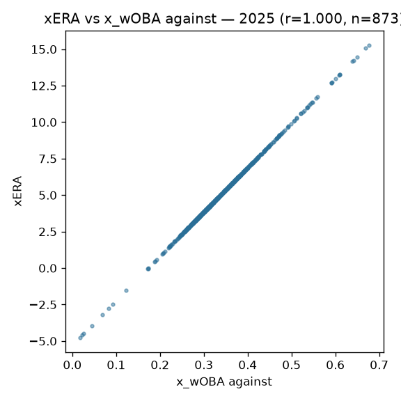

# MLB pitching models: xERA, Stuff+, Command+

## Overview

Three surfaces on `mlb_pitching_models`: **xERA** (contact-quality ERA),
**Stuff+** (pitch-physics quality: velocity, movement, release), and
**Command+** (location quality) — the stuff/command decomposition of
pitching, computed from the pitch-features substrate.

## Data & feature engineering

Baseball Savant pitch-level features via sdv-py's `x_era` / `mlb_stuff_plus` /
`mlb_command_plus`. Stuff+ deliberately excludes location; Command+
deliberately excludes physics — the decomposition is the point.

## Evaluation

Publish gates: xERA MAE vs Savant's own xERA ≤ 0.30; Stuff+ Spearman vs
run value ≥ 0.20 and Command+ ≥ 0.04 — the Command+ gate is explicitly
**directional only**, a weak ordinal signal stated as such rather than
inflated.
Computed from the published 2025 asset: xERA vs x_wOBA-against Pearson r = **1.0** over 873 pitchers — r = 1.0 means the published xERA is a deterministic monotone transform of x_wOBA: the two columns currently carry ONE signal (recorded as an open issue below).

## Reproducibility

`scripts/mlb_models.sh 03` → `mlb_model_publish pitching`. Card:
[`../../mlb/pitching_models/mlb_pitching_models_card.json`](../../mlb/pitching_models/mlb_pitching_models_card.json).

## Limitations

Public pitch features lack seam-shifted-wake and grip data; Command+'s weak
gate reflects a real ceiling of location-only value measurement, not a bug.

## Avenues for improvement & open issues

- **Stuff+ vs run value remains a weak-signal gate (>= 0.20)** — pitch-level
  target engineering (per-pitch run value with count context) is the known
  lever.
- **Known issue:** Command+'s 0.04 directional gate is honest but near-noise;
  treat the column as ordinal at best.
- **FLAGGED (2026-09-01):** published xERA is a PERFECT monotone transform of
  x_wOBA-against (r = 1.0) — the asset carries one signal in two columns;
  either differentiate the recipe (batted-ball mix, park) or document xERA as
  a display transform.
