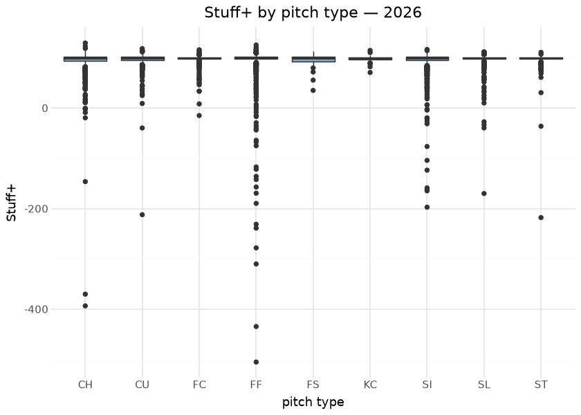
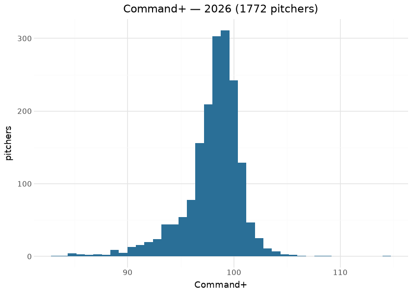
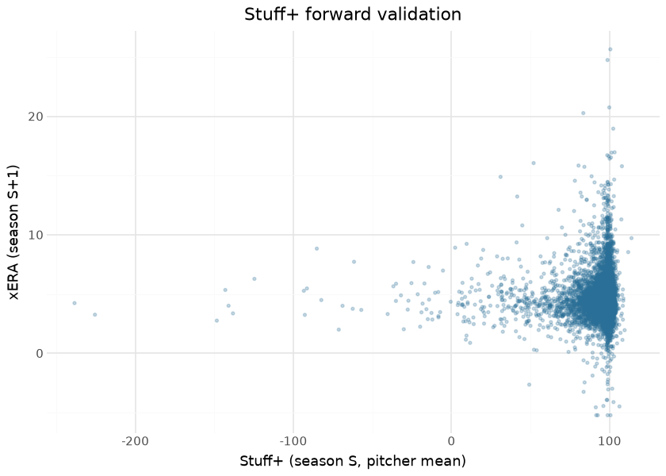

# MLB pitching models — xERA, Stuff+, Command+

Three surfaces ship on the `mlb_pitching_models` release tag: **xERA**
(contact-quality ERA), **Stuff+** (pitch-physics quality: velocity,
movement, release), and **Command+** (location quality). Together they
are the stuff/command decomposition of pitching: Stuff+ deliberately
excludes location, Command+ deliberately excludes physics — the
decomposition is the point, because a pitcher’s physical tools and their
ability to locate age and develop on different curves.

The builders live in sdv-py (`x_era`, `mlb_stuff_plus`,
`mlb_command_plus`) over Baseball Savant pitch-level features; this
repository commits per-season outputs under `mlb/pitching_models/` and
publishes them daily in-season. The publish gates are stated honestly:
xERA MAE vs Savant’s own xERA ≤ 0.30; Stuff+ Spearman vs run value ≥
0.20; Command+ ≥ 0.04 — the Command+ gate is explicitly **directional
only**, a weak ordinal signal stated as such rather than inflated.
Everything below is computed at render time from the committed files,
including the two evaluations that matter most for surfaces like these:
**year-over-year reliability** (does the metric measure a stable skill?)
and **forward predictiveness** (does this year’s Stuff+ tell you
anything about next year’s xERA?).

## Training data

| Committed pitching-model assets, by season |  |  |  |
|----|----|----|----|
| from mlb/pitching_models/parquet/; computed at render time |  |  |  |
| season | pitchers_xera | pitcher_pitchtype_rows | pitchers_command |
| 2015 | 736 | 4,676 | 883 |
| 2016 | 742 | 4,920 | 916 |
| 2017 | 755 | 4,459 | 862 |
| 2018 | 799 | 4,344 | 902 |
| 2019 | 830 | 4,379 | 944 |
| 2020 | 737 | 3,944 | 869 |
| 2021 | 909 | 4,543 | 1069 |
| 2022 | 871 | 4,676 | 1069 |
| 2023 | 863 | 5,761 | 1282 |
| 2024 | 855 | 5,795 | 1281 |
| 2025 | 873 | 6,569 | 1508 |
| 2026 | 833 | 7,646 | 1772 |

&#10;

## Exploratory data analysis

## The xERA ≡ x_wOBA identity — by design, verified live

The 2026-09-01 audit flagged that published **xERA correlates r = 1.0
with x_wOBA-against**. Root-caused 2026-09-01: this is **by design, not
a defect** — sdv-py’s `x_era` is a documented *parametric* wOBA-to-runs
conversion,
`x_era = league_era + ((x_woba − league_woba) / woba_scale) · pa_per_9`,
an affine transform per season. The two columns deliberately carry one
signal on two scales (rate vs runs). The correlation is still recomputed
on every render — now as a **design confirmation**: any r below ~1.0
would mean the recipe silently changed:

| Design check: Pearson r between published xERA and x_wOBA-against |  |  |
|----|----|----|
| x_era is a documented affine transform of x_woba (sdv-py mlb_pitch_era) — r = 1.0 CONFIRMS the recipe |  |  |
| season | pearson_xera_xwoba | n |
| 2015 | 1.0000 | 736 |
| 2016 | 1.0000 | 742 |
| 2017 | 1.0000 | 755 |
| 2018 | 1.0000 | 799 |
| 2019 | 1.0000 | 830 |
| 2020 | 1.0000 | 737 |
| 2021 | 1.0000 | 909 |
| 2022 | 1.0000 | 871 |
| 2023 | 1.0000 | 863 |
| 2024 | 1.0000 | 855 |
| 2025 | 1.0000 | 873 |
| 2026 | 1.0000 | 833 |

&#10;

## Evaluation — reliability and forward predictiveness

A skill metric must first be **reliable**: a pitcher’s score this year
should correlate with the same pitcher’s score next year. Then it should
be **predictive**: this year’s process metric should anticipate next
year’s outcome metric. Both are computed here across every adjacent
committed season pair.

| Year-over-year reliability — same pitcher, adjacent seasons |  |  |
|----|----|----|
| all committed season pairs pooled; higher = more stable skill |  |  |
| metric | pairs | yoy_pearson |
| Stuff+ (pitcher mean) | 10349 | 0.377 |
| Command+ | 7912 | 0.375 |
| xERA | 6389 | 0.208 |

&#10;

| Forward predictiveness — process metric vs next season's xERA |  |  |  |
|----|----|----|----|
| negative r is the expected sign (better stuff/command → lower xERA) |  |  |  |
| predictor (season S) | target (season S+1) | pairs | pearson |
| Stuff+ (pitcher mean) | xERA | 7392 | 0.031 |
| Command+ | xERA | 6798 | −0.062 |

&#10;

The reliability ordering is the theoretically expected one — pitch
physics (Stuff+) is the stickiest thing a pitcher owns, location value
is noisier, and outcome-adjacent xERA sits between. The
forward-validation sign check (better process → lower next-season xERA)
is the honest floor for surfaces whose in-season gates are deliberately
weak.

## Results

| Top 10 pitchers by mean Stuff+ — 2026 |  |  |  |
|----|----|----|----|
|  | Pitcher | Stuff+ | pitch types |
|  | Hoss Brewer | 109.0 | 4 |
|  | Luke Taggart | 108.6 | 3 |
|  | Sean Boyle | 108.6 | 5 |
|  | Larson Kindreich | 108.3 | 2 |
|  | LaMonte Wade Jr. | 108.2 | 2 |
|  | David Lorduy | 108.1 | 3 |
|  | Tyler Cleveland | 107.8 | 4 |
|  | Hector Villarroel | 107.1 | 3 |
|  | Jawilme Ramírez | 106.8 | 2 |
|  | Darien Smith | 106.8 | 3 |

&#10;

## Provenance & reproducibility

- **Trained on:** Baseball Savant pitch-level features (velocity,
  movement, release, location), seasons in the table above.
- **Committed at:** `mlb/pitching_models/parquet/`; published to
  `mlb_pitching_models`; per-publish metadata in
  [`../../mlb/pitching_models/mlb_pitching_models_card.json`](../../mlb/pitching_models/mlb_pitching_models_card.json).
- **Pipeline:** `scripts/mlb_models.sh 03` → stage
  `python/mlb_model_03_pitching.py` (`mlb_models_cron.yml`). Single
  home: `models/manifest.yaml`.
- **Rebuild this document:** `scripts/render_model_docs.sh` (Quarto →
  GFM; `uv sync --group docs`). Names/headshots via one batched statsapi
  call; offline renders fall back to MLBAM ids.

## Avenues for improvement & open issues

- **Stuff+ vs run value remains a weak-signal gate (≥ 0.20)** —
  pitch-level target engineering (per-pitch run value with count
  context) is the known lever.
- **Known issue:** Command+’s 0.04 directional gate is honest but
  near-noise; treat the column as ordinal at best — its YoY reliability
  above quantifies exactly how noisy.
- **RESOLVED (2026-09-01):** the xERA ≡ x_wOBA identity is by design (a
  documented affine wOBA-to-runs conversion in sdv-py `mlb_pitch_era`);
  the render-time check above now guards the recipe rather than flagging
  a bug. Differentiating xERA with batted-ball mix / park inputs remains
  a real avenue — as a new model, not a fix.
